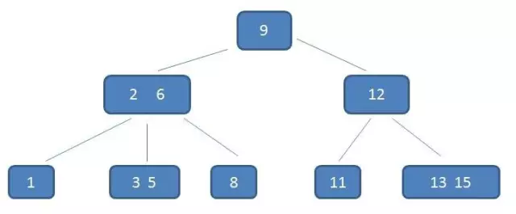

## 常见算法类型

- 排序算法（冒泡、插入、选择、快排、希尔、堆排、归并、桶排、基数、计数）、字符串操作、数组操作、递归、回溯、分治、动态规划等

- 如何准备算法可见历史文章：[进入BAT和字节跳动最难的一关，手撕代码！](https://mp.weixin.qq.com/s?__biz=MzI2MTcxNjg5OA==&mid=2247483913&idx=1&sn=7038fe493411992bef3241336cc4fa82&chksm=ea576cc4dd20e5d2a40f846264a80669328160dbce734186b3c6e037f2c9d7871670d8d25b8f&scene=21#wechat_redirect)


#### 排序算法
https://www.cnblogs.com/onepixel/articles/7674659.html


- [冒泡排序](http://mp.weixin.qq.com/s?__biz=MzIxMjE5MTE1Nw==&mid=2653194666&idx=1&sn=69ce32870c0b981c40b1e124fbb6bba8&chksm=8c99fb70bbee72668cad223892ad362525d215e7f936458f99dd289eb82981099359310e9e54&scene=21#wechat_redirect)
- [快速排序](https://mp.weixin.qq.com/s?__biz=MzIxMjE5MTE1Nw==&mid=2653195042&idx=1&sn=2b0915cd2298be9f2163cc90a3d464da&chksm=8c99f9f8bbee70eef627d0f5e5b80a604221abb3a1b5617b397fa178582dcb063c9fb6f904b3&scene=21#wechat_redirect)
```cpp
    void QSort(vector<int> &arr, int left, int right) {
    	if (left >= right) return;

    	int low = left;
    	int high = right;

    	int key = arr[left];
    	while (left < right) {
    		while (left < right && arr[right] >= key) right--;
    		arr[left] = arr[right];
    		while (left < right && arr[left] <= key) left++;
    		arr[right] = arr[left];
    	}
    	arr[left] = key;
    	QSort(arr, low, left - 1);
    	QSort(arr, left + 1, high);
    }
```
- [堆排序](http://mp.weixin.qq.com/s?__biz=MzIxMjE5MTE1Nw==&mid=2653195208&idx=1&sn=e3d6559402148458f0a4993b47d8bc6f&chksm=8c99f912bbee7004625a0b204acc8484acbdf4f1b18953e7ff5acbea958ec002d8c8ea072792&scene=21#wechat_redirect)
- 二叉堆本质上是一种完全二叉树，分为最大堆和最小堆。
    - `大顶堆：priority_queue<int>，即 priority_queue<int, vector<int>, less<int>> q;`
    - `小顶堆：priority_queue<int, vector<int>, greater<int>> q;`
- 二叉树前序、中序、后序递归遍历及非递归遍历。
    - 前序遍历：https://leetcode-cn.com/problems/binary-tree-preorder-traversal/
    - 中序遍历：https://leetcode-cn.com/problems/binary-tree-inorder-traversal/
    - 后序遍历：https://leetcode-cn.com/problems/binary-tree-postorder-traversal/

```cpp
class Solution {
public:
    // 前序，根左右
    vector<int> preorderTraversal(TreeNode* root) {
        vector<int> ans;
        if (root == nullptr) return ans;

        stack<TreeNode*> s;
        s.push(root);
        while (!s.empty()) {
            TreeNode* node = s.top();
            s.pop();
            ans.push_back(node->val);
            if (node->right) s.push(node->right);
            if (node->left) s.push(node->left);
        }

        return ans;
    }

    // 中序，左根右
    vector<int> inorderTraversal(TreeNode* root) {
        vector<int> ans;
        if (root == nullptr) return ans;

        stack<TreeNode*> s;
        TreeNode* node = root;
        while (node || !s.empty()) {
            while (node) {
                s.push(node);
                node = node->left;
            }
            node = s.top();
            s.pop();
            ans.push_back(node->val);
            node = node->right;
        }
        return ans;
    }

    // 后续，根右左的逆序
    vector<int> postorderTraversal(TreeNode* root) {
        vector<int> ans;
        if (root == nullptr) return ans;

        stack<TreeNode*> s;
        s.push(root);
        while (!s.empty()) {
            TreeNode* node = s.top();
            s.pop();
            ans.push_back(node->val);
            if (node->left) s.push(node->left);
            if (node->right) s.push(node->right);
        }
        reverse(ans.begin(), ans.end());

        return ans;
    }
};
```


## 常用数据结构
> 务必熟悉底层原理和实现

- 链表、栈、队列、树(二叉树、平衡二叉树、红黑树、B树、B+树、哈夫曼树、字典树)、跳表、图

#### AVL树、红黑树
红黑树：https://mp.weixin.qq.com/s?__biz=MzIxMjE5MTE1Nw==&mid=2653204996&idx=2&sn=ecf932d2db8cb6e4fcb841a2b6a5bfba&chksm=8c99c0debbee49c86dc8e82a2d195389a93e81d8e5ca8af7d4dd2eec5c7fe209038c91444964&scene=21#wechat_redirect
B-树：https://mp.weixin.qq.com/s?__biz=MzIxMjE5MTE1Nw==&mid=2653190965&idx=1&sn=53f78fa037386f85531832cd5322d2a0&chksm=8c9909efbbee80f90512f0c36356c31cc74c388c46388dc2317d43c8f8597298f233ca9c29e9&scene=21#wechat_redirect
B+树：https://mp.weixin.qq.com/s?__biz=MzIxMjE5MTE1Nw==&mid=2653191027&idx=1&sn=4ba22e3ec8bd149f69fc0aba72e4347e&chksm=8c9909a9bbee80bfa1d8497ff0525df130414c1731b5aa5287bf16ea1cf86c8d8e6f20782184&scene=21#wechat_redirect
- AVL树（平衡二叉树）（AVL树得名于它的发明者G. M. Adelson-Velsky和E. M. Landis）本质上还是一棵二叉搜索树，它的特点是：
    - 1.本身首先是一棵二叉搜索树。
    - 2.带有平衡条件：每个结点的左右子树的高度之差的绝对值（平衡因子）最多为1。
- 红黑树是一颗AVL树，同时满足下面的特性：
    - 1.结点是红色或黑色。
    - 2.根结点是黑色。
    - 3.每个叶子结点都是黑色的空结点（NIL结点）。
    - 4 每个红色结点的两个子结点都是黑色。(从每个叶子到根的所有路径上不能有两个连续的红色结点)
    - 5.从任一结点到其每个叶子的所有路径都包含相同数目的黑色结点。
- 在需要频繁查找时，选用AVL树更合适，在需要频繁插入删除时，选用红黑树更合适。
- 一个m阶的B-树具有如下几个特征：
    - 1.根结点至少有两个子女。
    - 2.每个中间节点都包含k-1个元素和k个孩子，其中 m/2 <= k <= m
    - 3.每一个叶子节点都包含k-1个元素，其中 m/2 <= k <= m
    - 4.所有的叶子结点都位于同一层。
    - 5.每个节点中的元素从小到大排列，节点当中k-1个元素正好是k个孩子包含的元素的值域分划。
- B-树主要用于文件系统以及部分数据库索引，比如著名的非关系型数据库MongoDB。大部分关系型数据库比如MySql则使用B+树作为索引。

- 一个m阶的B+树具有如下几个特征：
    - 1.有k个子树的中间节点包含有k个元素（B树中是k-1个元素），每个元素不保存数据，只用来索引，所有数据都保存在叶子节点。
    - 2.所有的叶子结点中包含了全部元素的信息，及指向含这些元素记录的指针，且叶子结点本身依关键字的大小自小而大顺序链接。
    - 3.所有的中间节点元素都同时存在于子节点，在子节点元素中是最大（或最小）元素。

- B+树的优势：
    - 1.单一节点存储更多的元素，使得查询的IO次数更少。
    - 2.所有查询都要查找到叶子节点，查询性能稳定。
    - 3.所有叶子节点形成有序链表，便于范围查询。

#### Hash表设计、一致性Hash
一致性Hash：https://mp.weixin.qq.com/s?__biz=MzIxMjE5MTE1Nw==&mid=2653191083&idx=1&sn=c68c8bb7e18c4d46b85666be10e9ef50&chksm=8c990971bbee80675b6cd0ac3c2c17546cd434c3636616e559ca5cf10d1815c3aed24bfd3c83&scene=21#wechat_redirect
###### Hash表设计：
- 哈希函数的设计：对于构造哈希来说，主要包括直接地址法、平方取中法、除留余数法等
- 解决哈希冲突
    - 开放定址法: 开放地址法有个非常关键的特征，就是所有输入的元素全部存放在哈希表里，也就是说，位桶的实现是不需要任何的链表来实现的，换句话说，也就是这个哈希表的装载因子不会超过1。它的实现是在插入一个元素的时候，先通过哈希函数进行判断，若是发生哈希冲突，就以当前地址为基准，根据再寻址的方法（探查序列），去寻找下一个地址，若发生冲突再去寻找，直至找到一个为空的地址为止。所以这种方法又称为再散列法。
    - 再哈希法：当发生哈希冲突时使用另一个哈希函数计算地址值，直到冲突不再发生。这种方法不易产生聚集，但是增加计算时间，同时需要准备许多哈希函数。
    - 链地址法：将所有哈希值相同的Key通过链表存储。key按顺序插入到链表中
    - 建立公共溢出区：建立一个公共溢出区域，把hash冲突的元素都放在该溢出区里。查找时，如果发现hash表中对应桶里存在其他元素，还需要在公共溢出区里再次进行查找。


## 推荐书籍

- 《大话数据结构》适合入门学习

- 《剑指offer》必刷66题

- 《算法导论》尽量看，能啃完就是大神