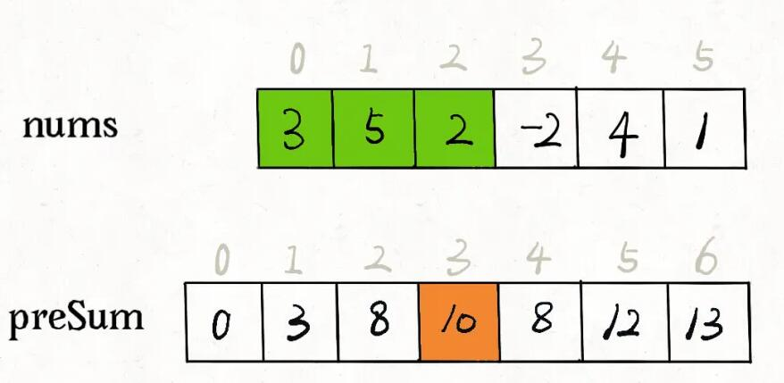

## BFS算法框架
```cpp
// 计算从起点 start 到终点 target 的最近距离
int BFS(Node start, Node target) {
    Queue<Node> q; // 核心数据结构
    Set<Node> visited; // 避免走回头路

    q.offer(start); // 将起点加入队列
    visited.add(start);
    int step = 0; // 记录扩散的步数

    while (q not empty) {
        int sz = q.size();
        /* 将当前队列中的所有节点向四周扩散 */
        for (int i = 0; i < sz; i++) {
            Node cur = q.poll();
            /* 划重点：这里判断是否到达终点 */
            if (cur is target)
                return step;
            /* 将 cur 的相邻节点加入队列 */
            for (Node x : cur.adj())
                if (x not in visited) {
                    q.offer(x);
                    visited.add(x);
                }
        }
        /* 划重点：更新步数在这里 */
        step++;
    }
}
```

## 动态规划算法框架
```cpp
## 初始化 base case
dp[0][0][...] = base
## 进行状态转移
for 状态1 in 状态1的所有取值：
    for 状态2 in 状态2的所有取值：
        for ...
            dp[状态1][状态2][...] = 求最值(选择1，选择2...)
```

## 二分查找模版
```cpp
int binary_search(int[] nums, int target) {
    int left = 0, right = nums.length - 1;
    while(left <= right) {
        int mid = left + (right - left) / 2;
        if (nums[mid] < target) {
            left = mid + 1;
        } else if (nums[mid] > target) {
            right = mid - 1;
        } else if(nums[mid] == target) {
            // 直接返回
            return mid;
        }
    }
    // 直接返回
    return -1;
}

int left_bound(int[] nums, int target) {
    int left = 0, right = nums.length - 1;
    while (left <= right) {
        int mid = left + (right - left) / 2;
        if (nums[mid] < target) {
            left = mid + 1;
        } else if (nums[mid] > target) {
            right = mid - 1;
        } else if (nums[mid] == target) {
            // 别返回，锁定左侧边界
            right = mid - 1;
        }
    }
    // 最后要检查 left 越界的情况
    if (left >= nums.length || nums[left] != target)
        return -1;
    return left;
}

int right_bound(int[] nums, int target) {
    int left = 0, right = nums.length - 1;
    while (left <= right) {
        int mid = left + (right - left) / 2;
        if (nums[mid] < target) {
            left = mid + 1;
        } else if (nums[mid] > target) {
            right = mid - 1;
        } else if (nums[mid] == target) {
            // 别返回，锁定右侧边界
            left = mid + 1;
        }
    }
    // 最后要检查 right 越界的情况
    if (right < 0 || nums[right] != target)
        return -1;
    return right;
}
```

## 滑动窗口算法框架
```cpp
/* 滑动窗口算法框架 */
void slidingWindow(string s, string t) {
    unordered_map<char, int> need, window;
    for (char c : t) need[c]++;

    int left = 0, right = 0;
    int valid = 0;
    while (right < s.size()) {
        // c 是将移入窗口的字符
        char c = s[right];
        // 右移窗口
        right++;
        // 进行窗口内数据的一系列更新
        ...

        /*** debug 输出的位置 ***/
        printf("window: [%d, %d)\n", left, right);
        /********************/

        // 判断左侧窗口是否要收缩
        while (window needs shrink) {
            // d 是将移出窗口的字符
            char d = s[left];
            // 左移窗口
            left++;
            // 进行窗口内数据的一系列更新
            ...
        }
    }
}
```
- [76.最小覆盖子串](https://leetcode-cn.com/problems/minimum-window-substring/)

## 回溯算法框架
```cpp
result = []
def backtrack(路径, 选择列表):
    if 满足结束条件:
        result.add(路径)
        return

    for 选择 in 选择列表:
        做选择
        backtrack(路径, 选择列表)
        撤销选择
```
- [51.N皇后](https://leetcode-cn.com/problems/n-queens/)
- [17.电话号码的字母组合](https://leetcode-cn.com/problems/letter-combinations-of-a-phone-number/)

## 排序算法
### 快速排序
```cpp
    void QSort(vector<int> &arr, int left, int right) {
    	if (left >= right) return;

    	int low = left;
    	int high = right;

    	int key = arr[left];
    	while (left < right) {
    		while (left < right && arr[right] >= key) right--;
    		arr[left] = arr[right];
    		while (left < right && arr[left] <= key) left++;
    		arr[right] = arr[left];
    	}
    	arr[left] = key;
    	QSort(arr, low, left - 1);
    	QSort(arr, left + 1, high);
    }
```

- 单点更新，范围查询，用线段树。范围更新，单独查询，用差分数组

## 前缀和、差分数组
### 前缀和
- 前缀和主要适用的场景是原始数组不会被修改的情况下，频繁查询某个区间的累加和



```
class PrefixSum {
public:
    /* 输入一个数组，构造前缀和 */
    PrefixSum(vector<int> nums) {
        prefix.resize(nums.size() + 1);
        // 计算 nums 的累加和
        for (int i = 1; i < prefix.size(); i++) {
            prefix[i] = prefix[i - 1] + nums[i - 1];
        }
    }

    /* 查询闭区间 [i, j] 的累加和 */
    int query(int i, int j) {
        return prefix[j + 1] - prefix[i];
    }
private:
    // 前缀和数组
    vector<int> prefix;
};
```

`prefix[i]` 就代表着 `nums[0..i-1]` 所有元素的累加和，如果我们想求区间 `nums[i..j]` 的累加和，只要计算 `prefix[j+1] - prefix[i]` 即可，而不需要遍历整个区间求和。


### 差分数组
- 差分数组的主要适用场景是频繁对原始数组的某个区间的元素进行增减
- 题目：[1109. 航班预订统计](https://leetcode-cn.com/problems/corporate-flight-bookings/)

```
class Difference {
public:
    Difference(vector<int> nums) {
        diff.resize(nums.size());
        // 构造差分数组
        diff[0] = nums[0];
        for (int i = 1; i < nums.size(); i++) {
            diff[i] = nums[i] - nums[i - 1];
        }
    }

    /* 给闭区间 [i,j] 增加 val（可以是负数）*/
    void increment(int i, int j, int val) {
        diff[i] += val;
        if (j + 1 < diff.size()) {
            diff[j + 1] -= val;
        }
    }

    vector<int> result() {
        vector<int> res;
        res.resize(diff.size());
        // 根据差分数组构造结果数组
        res[0] = diff[0];
        for (int i = 1; i < diff.size(); i++) {
            res[i] = res[i - 1] + diff[i];
        }
        return res;
    }

private:
    // 差分数组
    vector<int> diff;
};
```

## 前缀树
```cpp
class Trie {
public:
    /** Initialize your data structure here. */
    Trie() {

    }

    /** Inserts a word into the trie. */
    void insert(string word) {
        Trie *node = this;
        for (auto c : word) {
            if (node->next[c - 'a'] == nullptr) {
                node->next[c - 'a'] = new Trie();
            }
            node = node->next[c - 'a'];
        }
        node->isEnd = true;
    }

    /** Returns if the word is in the trie. */
    bool search(string word) {
        Trie *node = this;
        for (auto c : word) {
            if (node->next[c - 'a'] == nullptr) {
                return false;
            }
            node = node->next[c - 'a'];
        }
        return node->isEnd;
    }

    /** Returns if there is any word in the trie that starts with the given prefix. */
    bool startsWith(string prefix) {
        Trie *node = this;
        for (auto c : prefix) {
            if (node->next[c - 'a'] == nullptr) {
                return false;
            }
            node = node->next[c - 'a'];
        }
        return true;
    }
private:
    bool isEnd = false;
    Trie *next[26] = { nullptr };
};

/**
 * Your Trie object will be instantiated and called as such:
 * Trie* obj = new Trie();
 * obj->insert(word);
 * bool param_2 = obj->search(word);
 * bool param_3 = obj->startsWith(prefix);
 */
```

## 并查集
```cpp
class UnionFind {
public:
    UnionFind(int n) {
        size = n;
        parent.resize(n);
        for (int i = 0; i < size; i++) {
            parent[i] = i;
        }
    }

    int Find(int x) {           // 查找x的父节点
        if (x != parent[x]) {
            parent[x] = Find(parent[x]);    // 路径压缩
        }
        return parent[x];
    }

    void Union(int x, int y) {
        x = Find(x);
        y = Find(y);
        parent[x] = y;
    }

    int Count() {
        int count = 0;
        for (int i = 0; i < size; i++) {
            if (parent[i] == i) {
                count++;
            }
        }
        return count;
    }

private:
    int size = 0;
    vector<int> parent;
};
```

## LRU
```cpp
https://leetcode-cn.com/problems/lru-cache/
struct DLListNode {
    int key;
    int val;
    DLListNode* prev;
    DLListNode* next;
    DLListNode(int k, int v) {
        key = k;
        val = v;
        prev = nullptr;
        next = nullptr;
    }
};

class LRUCache {
public:
    LRUCache(int capacity) {
        head = new DLListNode(0, 0);
        tail = new DLListNode(0, 0);
        head->next = tail;
        tail->next = head;
        size = capacity;
    }

    int get(int key) {
        int val = -1;
        if (nodes.count(key)) {
            val = nodes[key]->val;
            MoveToHead(nodes[key]);
        }
        return val;
    }

    void put(int key, int value) {
        if (nodes.count(key)) {
            DeleteNode(nodes[key]);
            DLListNode* node = new DLListNode(key, value);
            InsertHead(node);
            nodes[key] = node;
        } else {
            DLListNode* node = new DLListNode(key, value);
            if (nodes.size() == size) {
                RemoveTail();
            }
            InsertHead(node);
            nodes[key] = node;
        }
    }

private:
    void RemoveTail() {
        DeleteNode(tail->prev);
    }

    void InsertHead(DLListNode* node) {
        node->next = head->next;
        node->prev = head;
        head->next->prev = node;
        head->next = node;
    }

    void DeleteNode(DLListNode* node) {
        if (node) {
            DLListNode* next = node->next;
            node->prev->next = node->next;
            node->next->prev = node->prev;
            nodes.erase(node->key);
            delete node;
            node = nullptr;
        }
    }

    void MoveToHead(DLListNode* node) {
        node->prev->next = node->next;
        node->next->prev = node->prev;
        InsertHead(node);
    }

private:
    int size = 0;
    unordered_map<int, DLListNode*> nodes;   // key -> node
    DLListNode* head;
    DLListNode* tail;
};

/**
 * Your LRUCache object will be instantiated and called as such:
 * LRUCache* obj = new LRUCache(capacity);
 * int param_1 = obj->get(key);
 * obj->put(key,value);
 */
```
