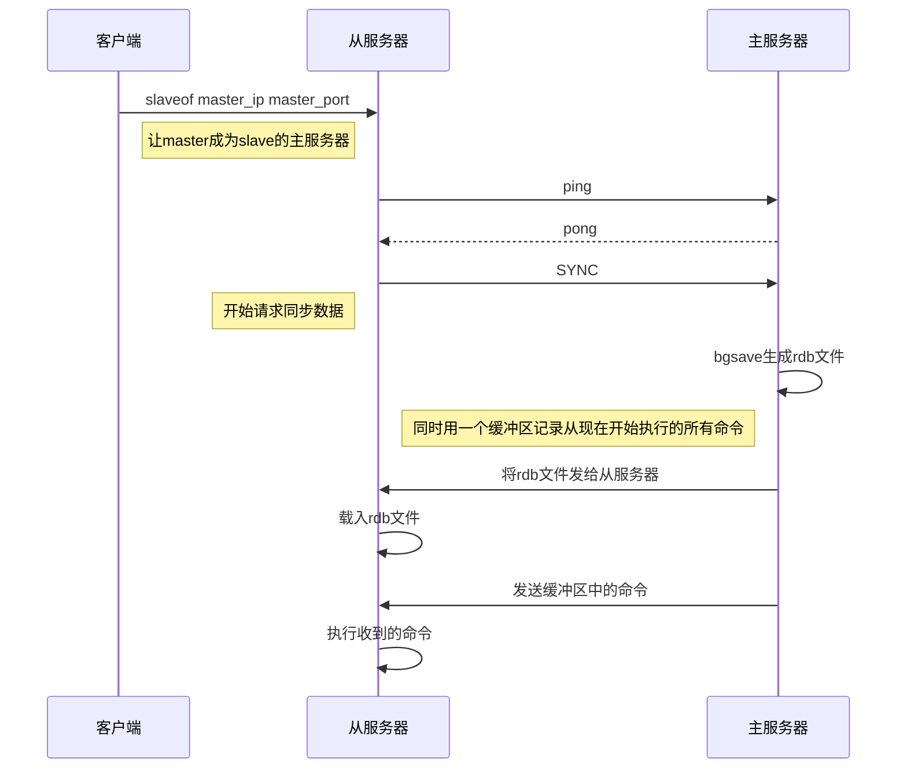

## 1、数据结构
### 1.1 SDS：Simple Dynamic Strings

```cpp
typedef char *sds;

/* Note: sdshdr5 is never used, we just access the flags byte directly.
 * However is here to document the layout of type 5 SDS strings. */
struct __attribute__ ((__packed__)) sdshdr5 {
    unsigned char flags; /* 3 lsb of type, and 5 msb of string length */
    char buf[];
};
struct __attribute__ ((__packed__)) sdshdr8 {
    uint8_t len; /* used */
    uint8_t alloc; /* excluding the header and null terminator */
    unsigned char flags; /* 3 lsb of type, 5 unused bits */
    char buf[];
};
struct __attribute__ ((__packed__)) sdshdr16 {
    uint16_t len; /* used */
    uint16_t alloc; /* excluding the header and null terminator */
    unsigned char flags; /* 3 lsb of type, 5 unused bits */
    char buf[];
};
struct __attribute__ ((__packed__)) sdshdr32 {
    uint32_t len; /* used */
    uint32_t alloc; /* excluding the header and null terminator */
    unsigned char flags; /* 3 lsb of type, 5 unused bits */
    char buf[];
};
struct __attribute__ ((__packed__)) sdshdr64 {
    uint64_t len; /* used */
    uint64_t alloc; /* excluding the header and null terminator */
    unsigned char flags; /* 3 lsb of type, 5 unused bits */
    char buf[];
};

#define SDS_TYPE_5  0
#define SDS_TYPE_8  1
#define SDS_TYPE_16 2
#define SDS_TYPE_32 3
#define SDS_TYPE_64 4
```

- len：表示buf中已占用字节数。
- alloc：表示buf中已分配字节数，不同于free，记录的是位buf分配的总长度。
- flags：表示当前结构体的类型，低3位用作标识位，高5位保留。
- buf：柔性数组，真正存储字符串的数据空间。
- `sdshdr5` 只负责存储小于32字节的字符串。`sdshdr5` 的类型和长度存储于 `flags` 中，低3位存储类型，高5位存储长度。

![sdshdr16结构][]
**<center>sdshdr16结构</center>**

### 1.2 跳跃表 skiplist
- 跳跃表是Redis有序集合的底层实现方式之一。

```cpp
typedef struct zskiplistNode {
    sds ele;        // 存储字符串类型的数据
    double score;   // 存储排序的分值
    struct zskiplistNode *backward;     // 后退指针，指向当前节点最底层的前一个节点，头节点和第一个节点的backward指向NULL，从后向前遍历跳跃表时使用。
    struct zskiplistLevel {
        struct zskiplistNode *forward;  // 指向本层的下一个节点，尾节点的forward指向NULL
        unsigned long span;             // forward节点指向的节点和本节点之间的元素个数。span越大，跳过的节点个数越多。
    } level[];      // 每个节点的数组长度不一样，在生成跳跃表时，随机生成一个1-64的值，值越大出现的概率越低。
} zskiplistNode;

typedef struct zskiplist {
    struct zskiplistNode *header, *tail;// 表头、表尾节点。头结点是一个特殊的节点，它的level数组元素个数是64。头结点不存储数据，不计入跳跃表长度
    unsigned long length;               // 跳跃表长度，表示出头节点之外的节点总数
    int level;                          // 跳跃表的高度
} zskiplist;
```

- 新增节点通过 `zslRandomLevel` 函数随机生成一个1-64的值，作为新建节点的高度，值越大出现的概率越低。节点层高确定之后不会再修改。

![跳跃表示例][]
**<center>跳跃表示例</center>**

### 1.3 压缩列表 ziplist
- ziplist本质上是一个字节数组，是redis为节约内存设计的一种线性数据结构，可以包含多个元素，每个元素可以是一个字节数组或一个整数。

![压缩列表结构示意图][]
**<center>压缩列表结构示意图</center>**

```cpp
/*
 * The following is a ziplist containing the two elements representing
 * the strings "2" and "5". It is composed of 15 bytes, that we visually
 * split into sections:
 *
 *  [0f 00 00 00] [0c 00 00 00] [02 00] [00 f3] [02 f6] [ff]
 *        |             |          |       |       |     |
 *     zlbytes        zltail    entries   "2"     "5"   end
 *
 * The first 4 bytes represent the number 15, that is the number of bytes
 * the whole ziplist is composed of. The second 4 bytes are the offset
 * at which the last ziplist entry is found, that is 12, in fact the
 * last entry, that is "5", is at offset 12 inside the ziplist.
 * The next 16 bit integer represents the number of elements inside the
 * ziplist, its value is 2 since there are just two elements inside.
 * Finally "00 f3" is the first entry representing the number 2. It is
 * composed of the previous entry length, which is zero because this is
 * our first entry, and the byte F3 which corresponds to the encoding
 * |1111xxxx| with xxxx between 0001 and 1101. We need to remove the "F"
 * higher order bits 1111, and subtract 1 from the "3", so the entry value
 * is "2". The next entry has a prevlen of 02, since the first entry is
 * composed of exactly two bytes. The entry itself, F6, is encoded exactly
 * like the first entry, and 6-1 = 5, so the value of the entry is 5.
 * Finally the special entry FF signals the end of the ziplist.
 *
 * Adding another element to the above string with the value "Hello World"
 * allows us to show how the ziplist encodes small strings. We'll just show
 * the hex dump of the entry itself. Imagine the bytes as following the
 * entry that stores "5" in the ziplist above:
 *
 * [02] [0b] [48 65 6c 6c 6f 20 57 6f 72 6c 64]
 *
 * The first byte, 02, is the length of the previous entry. The next
 * byte represents the encoding in the pattern |00pppppp| that means
 * that the entry is a string of length <pppppp>, so 0B means that
 * an 11 bytes string follows. From the third byte (48) to the last (64)
 * there are just the ASCII characters for "Hello World".
 */
```

- zlbytes：压缩列表的字节长度，占4个字节，因此压缩列表最多有2^32-1个字节。
- zltail：压缩列表尾元素相对于压缩列表起始地址的偏移量，占4个字节。
- zllen：压缩列表的元素个数，占2个字节。zllen无法存储超过2^16-1个元素，当值为UINT16_MAX时，必须遍历整个压缩列表才能获取到元素个数。
- entryX：压缩列表存储的元素，可以是字节数组或整数，长度不限。
- zlend：压缩列表的结尾，占一个字节，恒为0xFF

![压缩列表元素结构示意图][]
**<center>压缩列表元素结构示意图</center>**

- previous_entry_length：表示前一个元素的字节长度，占1个或5个字节。当前一个元素长度<254字节时，用1个字节表示；当前一个元素长度>=254字节时，用5个字节表示，此时第一个字节固定是0xFE，后4个字节才是真正的前一个元素长度值。
- encoding：表示当前元素的编码，即content存储的数据类型（整数或字节数组）

![压缩列表元素编码][]
**<center>压缩列表元素编码</center>**

- 在下图的压缩列表zl1中，删除P1位置的节点entryX，在压缩列表zl2中，P2位置插入节点entryY，会导致连锁更新。

![压缩列表连锁更新示意图][]
**<center>压缩列表连锁更新示意图</center>**

### 1.4 字典
![字典结构示意图][]
**<center>字典结构示意图</center>**

```
typedef struct dictEntry {
    void *key;              // 存储键
    union {
        void *val;          // db.dict中的val
        uint64_t u64;
        int64_t s64;        // db.expires中存储过期时间
        double d;
    } v;
    struct dictEntry *next; // 当hash冲突时，指向冲突的元素，形成单链表
} dictEntry;

/* This is our hash table structure. Every dictionary has two of this as we
 * implement incremental rehashing, for the old to the new table. */
typedef struct dictht {
    dictEntry **table;
    unsigned long size;
    unsigned long sizemask;
    unsigned long used;
} dictht;

typedef struct dict {
    dictType *type; // 该字典对应的特定操作函数
    void *privdata; // 该字典依赖的数据
    dictht ht[2];   // hash表，键值对存储于此
    long rehashidx; // rehash标识。默认值为-1，表示没有进行rehash操作。不为-1时，标识正在进行rehash操作，存储的值表示hash表ht[0]的rehash操作进行到了哪个索引值
    unsigned long iterators;    // 记录当前运行的安全迭代器数。当有安全迭代器绑定到该字典时，会暂定rehash操作。
} dict;
```

#### 1.4.1 渐进式rehash
rehash除了扩容时会触发，缩容时也会触发。Redis整个rehash的实现，主要分为如下几步完成。
- 1）给Hash表 `ht[1]` 申请足够的空间；扩容时空间大小为当前容量\*2，即 `d->ht[0].used * 2`；当使用量不到总空间10%时，则进行缩容。缩容时空间大小则为能恰好包含 `d->ht[0].used` 个节点的2^N次方幂整数，并把字典中字段 `rehashidx` 标识为0。
- 2）进行rehash操作调用的是 `dictRehash` 函数，重新计算 `ht[0]` 中每个键的Hash值与索引值（重新计算就叫rehash），依次添加到新的Hash表 `ht[1]` ，并把老Hash表中该键值对删除。把字典中字段 `rehashidx` 字段修改为Hash表 `ht[0]` 中正在进行rehash操作节点的索引值。
- 3）rehash操作后，清空 `ht[0]`，然后对调一下 `ht[1]` 与 `ht[0]` 的值，并把字典中 `rehashidx` 字段标识为-1。

### 1.5 intset
- 当集合中元素都是整型，并且元素个数小于512个（默认配置值 `set-max-intset-entries`）时，用intset保存。并且元素从小到大保存。

```cpp
    typedef struct intset {
        uint32_t encoding;  // 编码类型
        uint32_t length;    // 元素个数
        int8_t contents[];
    } intset;

    #define INTSET_ENC_INT16 (sizeof(int16_t))
    #define INTSET_ENC_INT32 (sizeof(int32_t))
    #define INTSET_ENC_INT64 (sizeof(int64_t))
```

### 1.6 quicklist
- `quicklist` 由 `List` 和 `ziplist` 结合而成。

![quicklist结构示意图][]
**<center>quicklist结构示意图</center>**

```cpp
/* quicklistNode is a 32 byte struct describing a ziplist for a quicklist.
 * We use bit fields keep the quicklistNode at 32 bytes.
 * count: 16 bits, max 65536 (max zl bytes is 65k, so max count actually < 32k).
 * encoding: 2 bits, RAW=1, LZF=2.
 * container: 2 bits, NONE=1, ZIPLIST=2.
 * recompress: 1 bit, bool, true if node is temporarry decompressed for usage.
 * attempted_compress: 1 bit, boolean, used for verifying during testing.
 * extra: 10 bits, free for future use; pads out the remainder of 32 bits */
typedef struct quicklistNode {
    struct quicklistNode *prev;
    struct quicklistNode *next;
    unsigned char *zl;
    unsigned int sz;             /* ziplist size in bytes */
    unsigned int count : 16;     /* count of items in ziplist */
    unsigned int encoding : 2;   /* RAW==1 or LZF==2 */
                                 /* 2表示使用LZF进行压缩，此时zl指向的结构为quicklistLZF */
    unsigned int container : 2;  /* NONE==1 or ZIPLIST==2 */
    unsigned int recompress : 1; /* was this node previous compressed? */
                                 /* 1表示该节点之前被压缩过，使用时需要解压使用，用完再压缩 */
    unsigned int attempted_compress : 1; /* node can't compress; too small */
    unsigned int extra : 10; /* more bits to steal for future usage */
} quicklistNode;

/* quicklistLZF is a 4+N byte struct holding 'sz' followed by 'compressed'.
 * 'sz' is byte length of 'compressed' field.
 * 'compressed' is LZF data with total (compressed) length 'sz'
 * NOTE: uncompressed length is stored in quicklistNode->sz.
 * When quicklistNode->zl is compressed, node->zl points to a quicklistLZF */
typedef struct quicklistLZF {
    unsigned int sz; /* LZF size in bytes*/
    char compressed[];
} quicklistLZF;

/* quicklist is a 40 byte struct (on 64-bit systems) describing a quicklist.
 * 'count' is the number of total entries.
 * 'len' is the number of quicklist nodes.
 * 'compress' is: -1 if compression disabled, otherwise it's the number
 *                of quicklistNodes to leave uncompressed at ends of quicklist.
 * 'fill' is the user-requested (or default) fill factor. */
typedef struct quicklist {
    quicklistNode *head;
    quicklistNode *tail;
    unsigned long count;        /* total count of all entries in all ziplists */
                                /* 所有 ziplist 中 entry 的总数 */
    unsigned long len;          /* number of quicklistNodes */
    int fill : 16;              /* fill factor for individual nodes */
                                /* 指明每个 quicklistNode 中 ziplist 长度。*/
                                /* 正数时表示每个 ziplist 最多包含的 entry 个数。 */
                                /* 负数时表示 ziplist 节点占用内存大小，-1~-5分别表示4/8/16/32/64KB */
    unsigned int compress : 16; /* depth of end nodes not to compress;0=off */
} quicklist;
```

### 1.7 Redis数据结构
#### 1.7.1 String
- int、raw、embstr.

#### 1.7.2 List
- quicklist

#### 1.7.3 Hash
- ziplist、hashtable
- 当同时满足下面两个条件时，采用ziplist作为底层存储，否则需要转换为散列表存储。值得注意的是，ziplist的存储顺序与插入顺序一致，而散列表的存储则不一致。
    - key-value结构的所有键值对的字符串长度都小于 `hash-max-ziplist-value` （默认值64），该值可以通过配置文件配置。
    - 散列对象保存的键值对的个数（一个键值对记为1个）小于 `hash-max-ziplist-entries` （默认值512），该值也可以通过配置文件配置。

#### 1.7.4 Set
- 集合元素为字符串和数字，分别用 `dict` 和 `intset` 存储

#### 1.7.5 SortedSet
- 用到的数据结构是ziplit、dict、skiplist。
- `zset-max-ziplist-entries 128`：zset采用压缩列表时，元素个数的最大值。默认128。
- `zset-max-ziplist-value 64`：zset采用压缩列表时，每个元素的字符串长度的最大值。默认64。
- 创建zset时，默认使用ziplist底层实现，新插入元素时，满足以下条件任意一个，则将zset底层实现由ziplist转为skiplist，且不再转回ziplist：
    - zset中元素个数大于 `zset-max-ziplist-entries`
    - 插入元素的字符串长度大于 `zset-max-ziplist-value`

#### 1.7.5 HyperLogLog
- pfadd、pfcount、pfmerge
- 用来做基数统计，每个key用12KB内存，计算接近2^64个不同的元素。
- 可用于统计网站UV（去重统计访问页面人数）

#### 1.7.6 Bitmap
- setbit、getbit、bitcount
- 可用于统计用户每日签到等。

## 2、[Redis高可用](https://mp.weixin.qq.com/s/GD4bskDa9lYwzi5oC0dscA)
- 在Redis(Remote Dictionary Server)中，实现高可用的技术主要包括持久化、复制、哨兵和集群，下面分别说明它们的作用，以及解决了什么样的问题：
    - 持久化：持久化是最简单的高可用方法，有时甚至不被归为高可用的手段，主要作用是数据备份，即将数据存储在硬盘，保证数据不会因进程退出而丢失。
    - 复制：复制是高可用Redis的基础，哨兵和集群都是在复制基础上实现高可用的。复制主要实现了数据的多机备份以及对于读操作的负载均衡和简单的故障恢复。缺陷是故障恢复无法自动化、写操作无法负载均衡、存储能力受到单机的限制。
    - 哨兵：在复制的基础上，哨兵实现了自动化的故障恢复。缺陷是写操作无法负载均衡、存储能力受到单机的限制。
    - 集群：通过集群，Redis解决了写操作无法负载均衡以及存储能力受到单机限制的问题，实现了较为完善的高可用方案。

### 2.1、持久化
- AOF开启时，Redis启动时会优先载入AOF文件来恢复数据；只有当AOF关闭时，才会载入RDB文件恢复数据。
#### 2.1.1 RDB
- RDB持久化是将当前进程中的数据生成快照保存到硬盘（因此也称作快照持久化），保存的文件后缀是rdb；当Redis重新启动时，可以读取快照文件恢复数据。
- RDB持久化的触发分为手动触发和自动触发两种。
    - 手动触发：save命令和bgsave命令都可以生成RDB文件。save命令会阻塞Redis服务器进程，直到RDB文件创建完毕为止，在Redis服务器阻塞期间，服务器不能处理任何命令请求。bgsave命令会创建一个子进程，由子进程来负责创建RDB文件，父进程(即Redis主进程)则继续处理请求。bgsave命令执行过程中，只有fork子进程时会阻塞服务器，而对于save命令，整个过程都会阻塞服务器，因此save已基本被废弃，线上环境要杜绝save的使用。
    - 自动触发：自动触发最常见的情况是在配置文件中通过 `save m n`，指定当m秒内发生n次变化时，会触发bgsave。
    - `save m n` 的原理如下：每隔100ms，执行serverCron函数；在serverCron函数中，遍历save m n配置的保存条件，只要有一个条件满足，就进行bgsave。对于每一个save m n条件，只有下面两条同时满足时才算满足：
        - 当前时间-lastsave > m（lastsave时间戳也是Redis服务器维持的一个状态，记录的是上一次成功执行save/bgsave的时间。）
        - dirty >= n（dirty计数器是Redis服务器维持的一个状态，记录了上一次执行bgsave/save命令后，服务器状态进行了多少次修改(包括增删改)；而当save/bgsave执行完成后，会将dirty重新置为0。）
- 除了 `save m n` 以外，还有一些其他情况会触发bgsave：
    - 在主从复制场景下，如果从节点执行全量复制操作，则主节点会执行bgsave命令，并将rdb文件发送给从节点；
    - 执行shutdown命令时，自动执行rdb持久化
##### 小结
- RDB文件用于保存和还原Redis服务器所有数据库中的所有键值对数据。
- SAVE命令由服务器进程直接执行保存操作，所以该命令会阻塞服务器。
- BGSAVE令由子进程执行保存操作，所以该命令不会阻塞服务器。
- 服务器状态中会保存所有用save选项设置的保存条件，当任意一个保存条件被满足时，服务器会自动执行BGSAVE命令。
- RDB文件是一个经过压缩的二进制文件，由多个部分组成。
- 对于不同类型的键值对，RDB文件会使用不同的方式来保存它们。


#### 2.1.2 AOF
- RDB持久化是将进程数据写入文件，而AOF持久化(即Append Only File持久化)，则是将Redis执行的每次写命令记录到单独的日志文件中（有点像MySQL的binlog）；当Redis重启时再次执行AOF文件中的命令来恢复数据。
- Redis服务器默认开启RDB，关闭AOF；要开启AOF，需要在配置文件中配置：`appendonly yes`
- AOF的执行流程包括：
##### 2.1.2.1 命令追加(append)
- 将Redis的写命令追加到缓冲区aof_buf；
##### 2.1.2.2 文件写入(write)和文件同步(sync)
- 根据不同的同步策略将aof_buf中的内容同步到硬盘；AOF缓存区的同步文件策略由参数 `appendfsync` 控制，各个值的含义如下：
    - no：不执行fsync，由操作系统负责数据的刷盘。数据安全性最低但Redis性能最高。
    - always：每执行一次写入就会执行一次fsync。数据安全性最高但会导致Redis性能降低。
    - everysec：每1秒执行一次fsync操作。属于折中方案，在数据安全性和性能之间达到一个平衡。
- 生产环境一般配置为 `appendfsync everysec`，即每秒执行一次fsync操作。
##### 2.1.2.3 文件重写(rewrite)：定期重写AOF文件，达到压缩的目的。
- 有2种触发方式：
    - 自动触发：`auto-aof-rewrite-percentage 100`，`auto-aof-rewrite-min-size 64mb`，当AOF文件大于64MB时，并且AOF文件当前大小比基准大小增长了100%时会触发一次AOF重写。起始的基准大小为Redis重启并加载完AOF文件之后，aof_buf的大小。当执行完一次AOF重写之后，基准大小相应更新为重写之后AOF文件的大小。
    - 手动触发：执行 `bgrewriteaof` 命令。
- 虽然Redis将生成新AOF文件替换旧AOF文件的功能命名为“AOF文件重写”，但实际上，AOF文件重写并不需要对现有的AOF文件进行任何读取、分析或者写入操作，这个功能是通过读取服务器当前的数据库状态来实现的。`首先从数据库中读取键现在的值，然后用一条命令去记录键值对，代替之前记录这个键值对的多条命令，这就是AOF重写功能的实现原理。`
- 如果服务端执行一条命令时正在执行AOF重写，命令还会同步到AOF重写缓冲区 `aof_rewrite_buf_blocks` 中，这个缓冲区在服务器创建子进程之后开始使用，当Redis服务器执行完一个写命令之后，它会同时将这个写命令发送给AOF缓冲区和AOF重写缓冲区。
- 当子进程完成AOF重写工作之后，它会向父进程发送一个信号，父进程在接到该信号之后，会调用一个信号处理函数，并执行以下工作：
    - 1）将AOF重写缓冲区中的所有内容写入到新AOF文件中，这时新AOF文件所保存的数据库状态将和服务器当前的数据库状态一致。
    - 2）对新的AOF文件进行改名，原子地（atomic）覆盖现有的AOF文件，完成新旧两个AOF文件的替换。
    这个信号处理函数执行完毕之后，父进程就可以继续像往常一样接受命令请求了。
##### 2.1.2.4 小结
- AOF文件通过保存所有修改数据库的写命令请求来记录服务器的数据库状态。
- AOF文件中的所有命令都以Redis命令请求协议的格式保存。
- 命令请求会先保存到AOF缓冲区里面，之后再定期写入并同步到AOF文件。
- appendfsync选项的不同值对AOF持久化功能的安全性以及Redis服务器的性能有很大的影响。
- 服务器只要载入并重新执行保存在AOF文件中的命令，就可以还原数据库本来的状态。
- AOF重写可以产生一个新的AOF文件，这个新的AOF文件和原有的AOF文件所保存的数据库状态一样，但体积更小。
- AOF重写是一个有歧义的名字，该功能是通过读取数据库中的键值对来实现的，程序无须对现有AOF文件进行任何读入、分析或者写入操作。
- 在执行BGREWRITEAOF命令时，Redis服务器会维护一个AOF重写缓冲区，该缓冲区会在子进程创建新AOF文件期间，记录服务器执行的所有写命令。当子进程完成创建新AOF文件的工作之后，服务器会将重写缓冲区中的所有内容追加到新AOF文件的末尾，使得新旧两个AOF文件所保存的数据库状态一致。最后，服务器用新的AOF文件替换旧的AOF文件，以此来完成AOF文件重写操作。


#### 2.1.3 混合持久化
- 重启 Redis 时，我们很少使用 rdb 来恢复内存状态，因为会丢失大量数据。我们通常使用 AOF 日志重放，但是重放 AOF 日志性能相对 rdb 来说要慢很多，这样在 Redis 实例很大的情况下，启动需要花费很长的时间。
- Redis 4.0 为了解决这个问题，带来了一个新的持久化选项——混合持久化。将 rdb 文件的内容和增量的 AOF 日志文件存在一起。这里的 AOF 日志不再是全量的日志，而是 自持久化开始到持久化结束 的这段时间发生的增量 AOF 日志，通常这部分 AOF 日志很小：
- 于是在 Redis 重启的时候，可以先加载 rdb 的内容，然后再重放增量 AOF 日志就可以完全替代之前的 AOF 全量文件重放，重启效率因此大幅得到提升。

### 2.2 主从复制
- 主从复制，是指将一台 Redis 服务器的数据，复制到其他的 Redis 服务器
- Redis 主从复制支持 主从同步 和 从从同步 两种，后者是 Redis 后续版本新增的功能，以减轻主节点的同步负担。
- 2.8版本之前的主从同步流程图



- 2.8版本及以上版本PSYNC主从复制

![主从复制初始化流程图][]
**<center>主从复制初始化流程图</center>**
- 其中RUN_ID是主服务器id，由40个随机的16进制字符组成，OFFSET是复制偏移量
- `slaveof no one` 断开复制，不会删除已有的数据。
- 主节点配置 `requirepass` 来设置密码，从节点配置 `masterauth` 参数 (与主节点 `requirepass` 保持一致)，保证安全。
- Redis 2.8以前的复制功能不能高效地处理断线后重复制情况，但Redis 2.8新添加的部分重同步功能可以解决这个问题。使用PSYNC命令代替SYNC命令。
- 部分重同步通过复制偏移量、复制积压缓冲区、服务器运行ID三个部分来实现。
- 在复制操作刚开始的时候，从服务器会成为主服务器的客户端，并通过向主服务器发送命令请求来执行复制步骤，而在复制操作的后期，主从服务器会互相成为对方的客户端。
- 主服务器通过向从服务器传播命令来更新从服务器的状态，保持主从服务器一致，而从服务器则通过向主服务器发送命令来进行心跳检测，以及命令丢失检测。

### 2.3 哨兵
![哨兵部署方案][]
<center>哨兵部署方案</center>

#### 2.3.1 哨兵功能：
- 监控（Monitoring）： 哨兵会不断地检查主节点和从节点是否运作正常。
- 自动故障转移（Automatic failover）： 当 主节点 不能正常工作时，哨兵会开始 自动故障转移操作，它会将失效主节点的其中一个 从节点升级为新的主节点，并让其他从节点改为复制新的主节点。
- 配置提供者（Configuration provider）： 客户端在初始化时，通过连接哨兵来获得当前 Redis 服务的主节点地址。
- 通知（Notification）： 哨兵可以将故障转移的结果发送给客户端。

#### 2.3.2 主从切换
**检测主观下线**：在默认情况下，Sentinel会以每秒一次的频率向所有与它创建了命令连接的实例（包括主服务器、从服务器、其他Sentinel在内）发送PING命令，并通过实例返回的PING命令回复来判断实例是否在线。Sentinel配置文件中的 `down-after-milliseconds` 选项指定了Sentinel判断实例进入主观下线所需的时间长度：如果一个实例在down-after-milliseconds毫秒内，连续向Sentinel返回无效回复，那么Sentinel会修改这个实例所对应的实例结构，在结构的flags属性中打开SRI_S_DOWN标识，以此来表示这个实例已经进入主观下线状态。

**检查客观下线**：当Sentinel将一个主服务器判断为主观下线之后，为了确认这个主服务器是否真的下线了，它会向同样监视这一主服务器的其他Sentinel进行询问，看它们是否也认为主服务器已经进入了下线状态（可以是主观下线或者客观下线）。当Sentinel从其他Sentinel那里接收到足够数量的已下线判断之后，Sentinel就会将从服务器判定为客观下线，并对主服务器执行故障转移操作。当认为主服务器已经进入下线状态的Sentinel的数量，超过Sentinel配置中设置的quorum参数的值，那么该Sentinel就会认为主服务器已经进入客观下线状态。

**选举领头Sentinel**：当一个主服务器被判断为客观下线时，监视这个下线主服务器的各个Sentinel会进行协商，选举出一个领头Sentinel，并由领头Sentinel对下线主服务器执行故障转移操作。

**哨兵使用以下规则来选择新的主服务器**：
- 淘汰那些被标记为主观下线、已断线、或者最后一次回复 PING 命令的时间大于五秒钟的从服务器。
- 如果 `slave-priority` 为0，则不能被选中（`slave-priority` 可以在配置文件中指定。正整数，值越小优先级越高，当指定为0时，不能被选为主服务器）
- 淘汰与失效主服务器连接断开的时长超过 `down-after-milliseconds*10 ms` 的从服务器。
- 优先 `slave-priority` 高的，其次复制偏移量（replication offset）最大，再次带有最小运行 ID 的从服务器

### 2.4 集群
![集群部署方式][]
<center>集群部署方式</center>

- 在客户端执行 `cluster meet <ip> <port>` 构建集群。
- 通过 `cluster-enable` 配置决定是否开启集群模式。
- 整个数据库被分成16384个槽。`cluster addslots` 将一个或多个槽指派给当前节点负责。节点会将自己负责的槽告知给集群中其它节点。16384个槽都进行了指派，集群才会进入上线状态。
- 客户端查询key时，接收命令的节点先计算槽，是自己的则处理，不是则返回MOVED错误，格式为：`MOVED <slot> <ip>:<port>`，客户端收到后会向返回的ip和port请求。计算槽的公式为：`CRC16(key) & 16383`。通过 `cluster keyslot <key>` 可以查看key属于哪个slot。

#### 主从切换
- 集群之间会互相发送心跳包，心跳包中会包括从发送方视角所记录的关于其他节点的状态信息。当一个节点收到心跳包之后，如果检测到发送方（假设为A）标记某个节点（假设为B）处于pfail状态，则接收节点（假设为C）会检测B是否已经被大多数主节点标记为pfail状态。如果是，则C节点会向集群中所有节点发送一个fail包，通知其他节点B已经处于fail状态。
- 当一个主节点（假设为B）被标记为fail状态后，该主节点的所有Slave执行周期性函数clusterCron时，会从所有的Slave中选择一个复制偏移量最大的Slave节点（即数据最新的从节点，假设为D），然后D节点首先将其当前纪元（currentEpoch）加1，然后向所有的主节点发送failover授权请求包，当获得大多数主节点的授权后，开始执行主从切换。
- 手动切换：当一个从节点接收到 `cluster failover` 命令之后，执行手动切换。

#### 副本漂移
![集群副本漂移][]
<center>集群副本漂移</center>
我们只给其中一个主C增加两个从服务。假设主A发生故障，主A的从A1会执行切换，切换完成之后从A1变为主A1，此时主A1会出现单点问题。当检测到该单点问题后，集群会主动从主C的从服务中漂移一个给有单点问题的主A1做从服务。

#### 分片迁移
- 增加或删除节点都会进行分片迁移（slot迁移），即将该节点提供服务的分片迁移到其它节点。
    - 在节点A执行 `CLUSTER SETSLOT slot MIGRATING node`，将slot从A节点迁移到指定的node节点。注意，slot必须属于A节点，否则会报错。
    - `CLUSTER SETSLOT slot IMPORTING node`：将slot从指定节点迁移到A节点。


## 3、过期键删除策略
- 如果一个键过期了，那么它什么时候会被删除呢？
    - 定时删除：在设置键的过期时间的同时，创建一个定时器（timer），让定时器在键的过期时间来临时，立即执行对键的删除操作。
    - 惰性删除：放任键过期不管，但是每次从键空间中获取键时，都检查取得的键是否过期，如果过期的话，就删除该键；如果没有过期，就返回该键。
    - 定期删除：每隔一段时间，程序就对数据库进行一次检查，删除里面的过期键。至于要删除多少过期键，以及要检查多少个数据库，则由算法决定。
- Redis服务器实际使用的是惰性删除和定期删除两种策略：通过配合使用这两种删除策略，服务器可以很好地在合理使用CPU时间和避免浪费内存空间之间取得平衡。

## 4、淘汰策略
Redis的内存淘汰策略是指在Redis的用于缓存的内存不足时，怎么处理需要新写入且需要申请额外空间的数据。
- `volatile-lru`：从已设置过期时间的数据集（server.db[i].expires）中挑选最近最少使用的数据淘汰
- `volatile-lfu`：挑选使用频率最低的数据淘汰
- `volatile-random`：随机淘汰
- `volatile-ttl`：挑选将要过期的数据淘汰
- `allkeys-lru`：从数据集（server.db[i].dict）中挑选最近最少使用的数据淘汰
- `allkeys-lfu`：挑选使用频率最低的数据淘汰
- `allkeys-random`：随机淘汰

## 5、发布订阅
```
订阅：subscribe channel_name
发布：publish channel_name message
```


## 6、分布式锁
- `setnx (set if not exists)`，setnx加expire可能会死锁
- 2.8版本及之后：`set keyname val ex 5 nx`，当keyname不存在时，设置key，过期时间为5秒


[sdshdr16结构]:../image/sdshdr16结构.jpg
[跳跃表示例]:../image/跳跃表示例.jpg
[压缩列表结构示意图]:../image/压缩列表结构示意图.jpg
[压缩列表元素结构示意图]:../image/压缩列表元素结构示意图.jpg
[压缩列表元素编码]:../image/压缩列表元素编码.jpg
[压缩列表连锁更新示意图]:../image/压缩列表连锁更新示意图.jpg
[字典结构示意图]:../image/字典结构示意图.jpg
[quicklist结构示意图]:../image/quicklist结构示意图.jpg
[主从复制初始化流程图]:../image/主从复制初始化流程图.jpg
[哨兵部署方案]:../image/哨兵部署方案.jpg
[集群部署方式]:../image/集群部署方式.jpg
[集群副本漂移]:../image/集群副本漂移.jpg
[2.8之前主从同步]:../image/2.8之前主从同步.jpg