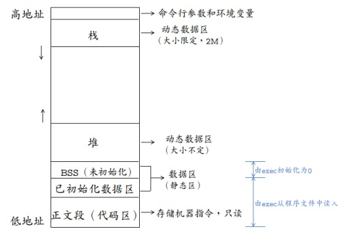

<span id="busuanzi_container_page_pv">本文总阅读量<span id="busuanzi_value_page_pv"></span>次</span>

## 1、C++语法基础
### 指针和引用
- 指针有自己的一块内存空间，引用只是一个别名。
- `sizeof` 指针大小为4，`sizeof` 引用为被引用对象的大小。
- 引用必须初始化，且是一个已存在对象的引用。指针可以初始化为 `nullptr`。
- 可以有const指针，但是没有const引用。

### 程序编译过程
- 预处理阶段：对源代码文件中文件包含关系（头文件）、预编译语句（宏定义）进行分析和替换，生成预编译文件。
- 编译阶段：将经过预处理后的预编译文件转换成特定汇编代码，生成汇编文件。
- 汇编阶段：将编译阶段生成的汇编文件转化成机器码，生成可重定位目标文件。
- 链接阶段：将多个目标文件及所需要的库连接成最终的可执行目标文件。

### static、const、#define的用法和区别
#### stacic
- 全局静态变量、局部静态变量，位于静态存储区。
- 静态函数，只能在当前.cpp或.c文件访问到
- 类的静态成员：多个对象之间的数据共享，在类的源文件中初始化：`int ClassName::paramName = 0;`
- 类的静态函数：不能直接引用类中声明的非静态成员，只能引用类中声明的静态成员。可通过如下方式调用：`ClassName::FuncName();`

#### const
- 修饰变量，说明变量不可被改变。
- 修饰指针，分为指向常量的指针和指针常量
    - 指针常量：`int const *p`，`p` 是一个指针，指向常量 `const int`
    - 常量指针：`int* const p`，`p` 是一个常量指针，指向 `int`
- 形参加 `const`，既避免了拷贝，又避免了函数对值的修改。
- 修饰成员函数，说明该成员函数内不能修改成员变量。

#### #define和const
- `const` 常量有数据类型，而宏常量没有，编译器可以对const常量进行类型安全检查，而后者只进行字符替换没有安全检查
- `const` 常量存在于程序的数据段，`#define` 常量存在于程序的代码段
- `define` 在预处理阶段进行替换，`const` 在编译时确定其值

### C 和 C++ 区别
- 设计思想上：
    - C++是面向对象的语言，而C是面向过程的结构化编程语言
- 语法上：
    - C++具有封装、继承和多态三种特性
    - C++相比C，增加多许多类型安全的功能，比如强制类型转换、
    - C++支持范式编程，比如模板类、函数模板等


### C++对象内存模型
虚函数表

### 内存中的栈和堆分配


- 在C++中，虚拟内存分为代码段、数据段、BSS段、堆区、文件映射区以及栈区六部分。
    - 代码段：包括只读存储区和文本区，其中只读存储区存储字符串常量，文本区存储程序的机器代码。
    - 数据段：存储程序中已初始化的全局变量和静态变量
    - bss 段：存储未初始化的全局变量和静态变量（局部+全局），以及所有被初始化为0的全局变量和静态变量。
    - 堆区：调用new/malloc函数时在堆区动态分配内存，同时需要调用delete/free来手动释放申请的内存。
    - 映射区：存储动态链接库以及调用mmap函数进行的文件映射
    - 栈：使用栈空间存储函数的返回地址、参数、局部变量、返回值

### 限制对象堆上或栈上创建
1.堆上创建： 析构函数private/protected
2.栈上创建： operator new / operator new [] 私有或protected

## 2、面对对象基础

### 面向对象理解

### 析构函数、构造函数、拷贝构造

### 虚函数、多态
- 多态的实现主要分为静态多态和动态多态，静态多态主要是重载，在编译的时候就已经确定；动态多态是用虚函数机制实现的，在运行期间动态绑定。举个例子：一个父类类型的指针指向一个子类对象时候，使用父类的指针去调用子类中重写了的父类中的虚函数的时候，会调用子类重写过后的函数，在父类中声明为加了virtual关键字的函数，在子类中重写时候不需要加virtual也是虚函数。
- 虚函数的实现：在有虚函数的类中，类的最开始部分是一个虚函数表的指针，这个指针指向一个虚函数表，表中放了虚函数的地址，实际的虚函数在代码段(.text)中。当子类继承了父类的时候也会继承其虚函数表，当子类重写父类中虚函数时候，会将其继承到的虚函数表中的地址替换为重新写的函数地址。使用了虚函数，会增加访问内存开销，降低效率。

### 纯虚函数和虚函数
- [C++中虚函数、虚继承内存模型](https://zhuanlan.zhihu.com/p/41309205)
- 静态多态是通过函数重载实现的；动态多态是通过虚函数实现的
- 构造函数不能是虚函数（因为在调用构造函数时，虚表指针并没有在对象的内存空间中，必须要构造函数调用完成后才会形成虚表指针）
- 纯虚函数是一种特殊的虚函数，在基类中不能对虚函数给出有意义的实现，而把它声明为纯虚函数，它的实现留给该基类的派生类去做。
- 虚函数在子类里面也可以不重载的；但纯虚函数必须在子类去实现。
- 带纯虚函数的类叫抽象类，这种类不能直接生成对象，而只有被继承，并重写其虚函数后，才能使用
- 将可能会被继承的父类的析构函数设置为虚函数，可以保证当我们new一个子类，然后使用基类指针指向该子类对象，释放基类指针时可以释放掉子类的空间，防止内存泄漏。
- C\+\+默认的析构函数不是虚函数是因为虚函数需要额外的虚函数表和虚表指针，占用额外的内存。而对于不会被继承的类来说，其析构函数如果是虚函数，就会浪费内存。因此C++默认的析构函数不是虚函数，而是只有当需要当作父类时，设置为虚函数。

### 虚函数实现机制
- 子类若重写父类虚函数，虚函数表中，该函数的地址会被替换，对于存在虚函数的类的对象，在VS中，对象的对象模型的头部存放指向虚函数表的指针，通过该机制实现多态。

### 虚函数表

### 访问限定符 public、private、protected

### 继承原理、虚继承、菱形继承
https://blog.51cto.com/zimomo/1784074
- 菱形继承：D继承B、C，B和C继承A，A有函数Func，D调用Func时调用不明确，
- 一种解决方法是使用域限定：d.A::Func()，d.B::Func().
- 另一种解决方法是虚继承，B和C虚继承A

### 静态绑定和动态绑定
- 静态绑定：模板函数
- 动态绑定：虚函数、多态
- 静态函数在编译的时候就已经确定运行时机，虚函数在运行的时候动态绑定。虚函数因为用了虚函数表机制，调用的时候会增加一次内存开销

### new/delete和malloc/free
new/delete是C++的关键字，而malloc/free是C语言的库函数，后者使用必须指明申请内存空间的大小，对于类类型的对象，后者不会调用构造函数和析构函数

### 重载、重写和隐藏
- 重载：两个函数名相同，但是参数列表不同（个数，类型），返回值类型没有要求，在同一作用域中
- 重写：子类继承了父类，父类中的函数是虚函数，在子类中重新定义了这个虚函数，这种情况是重写
- 隐藏：不同作用域中，定义的同名函数构成隐藏（不要求函数返回值和函数参数类型相同）。（派生类中与基类同返回值类型、同名和同参数的非虚函数也构成隐藏。）

## 3、语法进阶

### 常用的设计模式

### 线程安全的单例模式

### 内存溢出和内存泄漏

### C++11新特性汇总
https://www.lanqiao.cn/courses/605
- 基于范围的 `for` 循环
- `auto`，需要先初始化
- `nullptr`：`nullptr` 的类型为 `nullptr_t`。`nullptr` 出现的目的是为了替代 `NULL`。对于这两个函数来说，如果 `NULL` 又被定义为了 0， 那么 `foo(NULL);` 这个语句将会去调用 `foo(int)`，从而导致代码违反直观。
```cpp
    void foo(char *);
    void foo(int);
```
- lambda 表达式：
```cpp
[捕获列表](参数列表) mutable(可选) 异常属性 -> 返回类型 {
    // 函数体
}
```
- 右值引用、`std::move` 方法来将左值转换为右值、[右值引用，移动语义，完美转发](https://juejin.im/post/6861080373913370638)
    - `move` 实际上并不能移动任何东西，他唯一的功能是将一个左值强制转换为一个右值引用，使我们可以通过右值引用使用该值；
- 初始化列表：POD （plain old data，没有构造、析构和虚函数的类或结构体）类型都可以使用 `{}` 进行初始化
- `std::function`、`std::bind`/`std::placeholder`
- `unordered_map`、`unordered_set`、`tuple`
    - `unordered_map` 内部实现了哈希表，因此其查找速度非常的快
    - `map` 内部实现了一个红黑树，有序性，这是map结构最大的优点
- [智能指针](https://juejin.im/post/6844904198962675719)：`std::shared_ptr`、`std::unique_ptr`、`std::weak_ptr`
    - `std::shared_ptr` 是一种智能指针，它能够记录多少个 `shared_ptr` 共同指向一个对象，从而消除显示的调用 `delete`，当引用计数变为零的时候就会将对象自动删除
    - `std::unique_ptr` 是一种独占的智能指针，它禁止其他智能指针与其共享同一个对象，从而保证了代码的安全
    - `std::weak_ptr` 是一种弱引用（相比较而言 `std::shared_ptr` 就是一种强引用）。弱引用不会引起引用计数增加。为了解决shared_ptr相互引用导致的内存泄漏。
- 正则表达式库
- 语言级线程支持，`std::thread`, `std::mutex`, `std::future`

### 静态链接库和动态链接库
#### 静态链接
- 函数和数据被编译进一个二进制文件。在使用静态库的情况下，在编译链接可执行文件时，链接器从库中复制这些函数和数据并把它们和应用程序的其它模块组合起来创建最终的可执行文件。
- 空间浪费：因为每个可执行程序中对所有需要的目标文件都要有一份副本，所以如果多个程序对同一个目标文件都有依赖，会出现同一个目标文件都在内存存在多个副本；
- 更新困难：每当库函数的代码修改了，这个时候就需要重新进行编译链接形成可执行程序。
- 运行速度快：但是静态链接的优点就是，在可执行程序中已经具备了所有执行程序所需要的任何东西，在执行的时候运行速度快。

#### 动态链接
- 动态链接的基本思想是把程序按照模块拆分成各个相对独立部分，在程序运行时才将它们链接在一起形成一个完整的程序，而不是像静态链接一样把所有程序模块都链接成一个单独的可执行文件。
- 共享库：就是即使需要每个程序都依赖同一个库，但是该库不会像静态链接那样在内存中存在多份副本，而是这多个程序在执行时共享同一份副本；
- 更新方便：更新时只需要替换原来的目标文件，而无需将所有的程序再重新链接一遍。当程序下一次运行时，新版本的目标文件会被自动加载到内存并且链接起来，程序就完成了升级的目标。
- 性能损耗：因为把链接推迟到了程序运行时，所以每次执行程序都需要进行链接，所以性能会有一定损失。

### 强制类型转换
- const_cast：去const，用于将const变量转为非const
- static_cast：
    - 用于非多态类型的转换
    - 不执行运行时类型检查（转换安全性不如 dynamic_cast）
    - 通常用于转换数值数据类型（如 float -> int）
- dynamic_cast
    - 用于多态类型的转换
    - 执行运行时类型检查
    - 只适用于指针或引用
    - 可以在整个类层次结构中移动指针，包括向上转换、向下转换
- reinterpret_cast


### malloc内存分配原理
https://blog.csdn.net/wz1226864411/article/details/77934941

- malloc基本的实现原理就是维护一个内存空闲链表，当申请内存空间时，搜索内存空闲链表，找到适配的空闲内存空间，然后将空间分割成两个内存块，一个变成分配块，一个变成新的空闲块。如果没有搜索到，那么就会用sbrk()才推进brk指针来申请内存空间。
- 搜索空闲块最常见的算法有：首次适配，下一次适配，最佳适配。
    - 首次适配：第一次找到足够大的内存块就分配，这种方法会产生很多的内存碎片。
    - 下一次适配：也就是说等第二次找到足够大的内存块就分配，这样会产生比较少的内存碎片。
    - 最佳适配：对堆进行彻底的搜索，从头开始，遍历所有块，使用数据区大小大于size且差值最小的块作为此次分配的块。

#### 合并空闲块
在释放内存块后，如果不进行合并，那么相邻的空闲内存块还是相当于两个内存块，会形成一种假碎片。所以当释放内存后，我们需要将两个相邻的内存块进行合并。