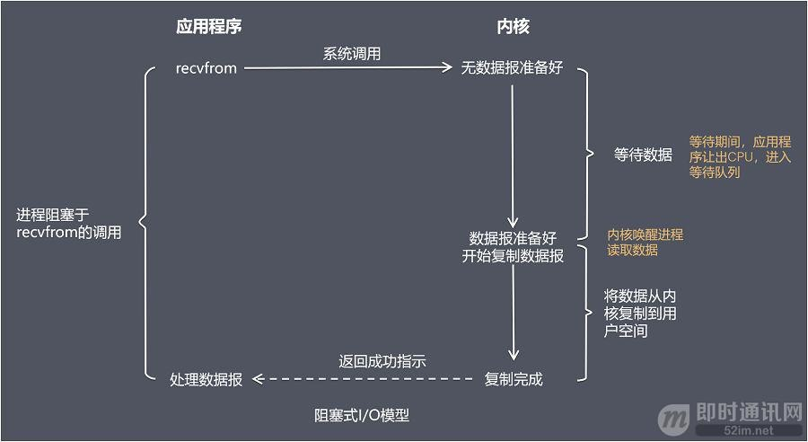
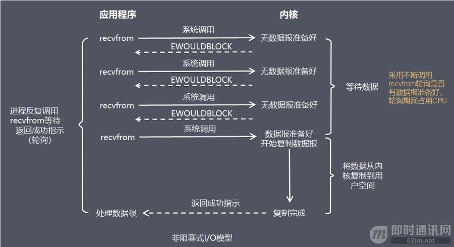
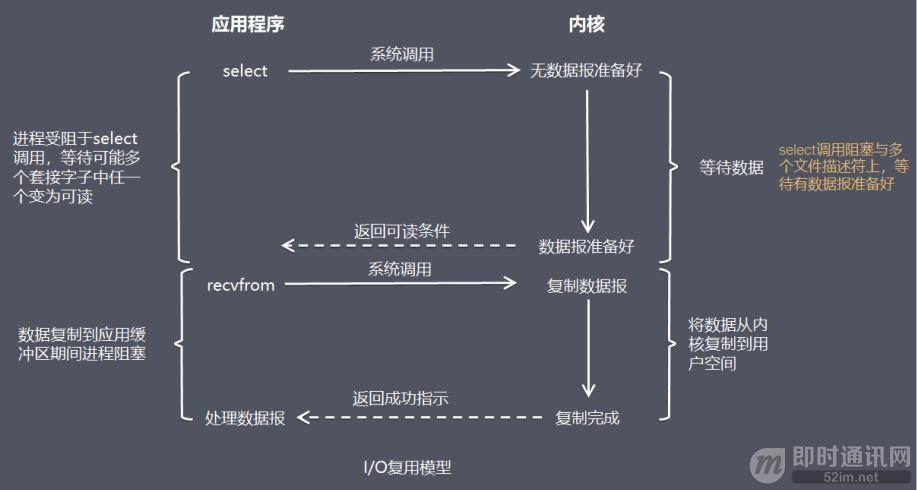
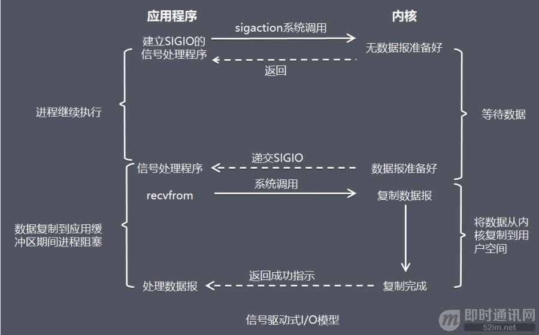
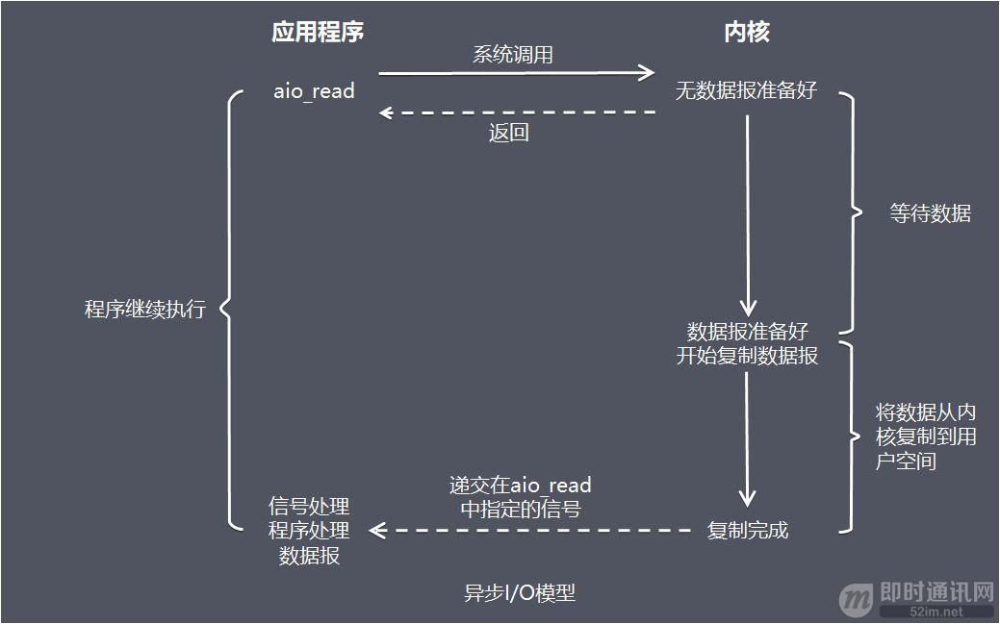
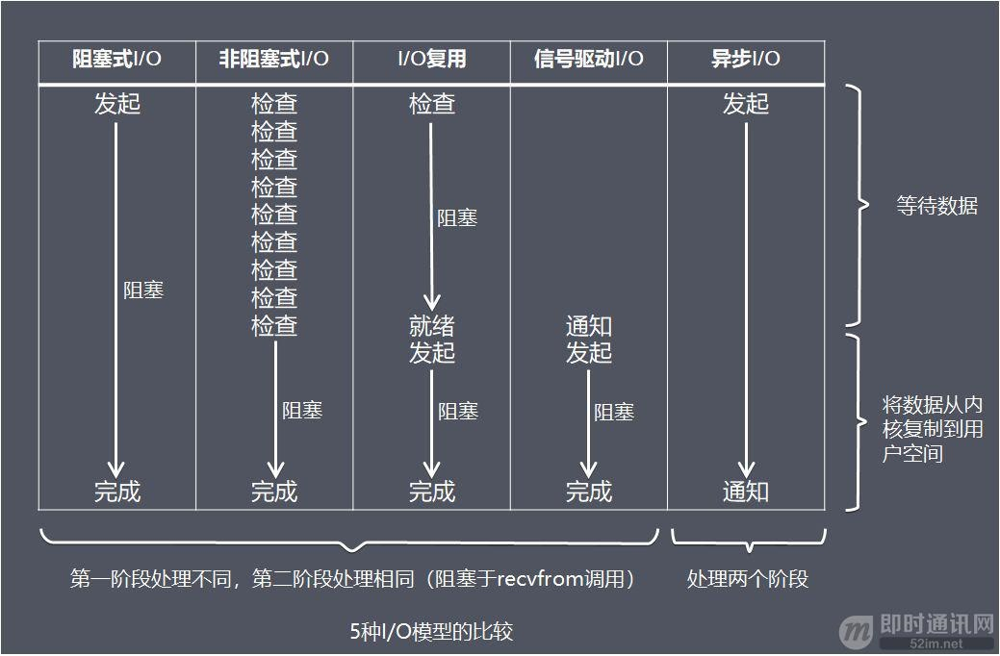

## 进程、线程、协程
- 进程是操作系统资源分配的最小单位，线程是cpu调度的最小单位。
- 进程有独立的系统资源，而同一进程内的线程共享进程的大部分系统资源,包括堆、代码段、数据段，每个线程只拥有一些在运行中必不可少的私有属性，比如tcb,线程Id,栈、寄存器。
- 一个进程崩溃，不会对其他进程产生影响；而一个线程崩溃，会让同一进程内的其他线程也死掉。
- 进程在创建、切换和销毁时开销比较大，而线程比较小。进程创建的时候需要分配系统资源，而销毁的的时候需要释放系统资源。进程切换需要分两步：切换页目录、刷新TLB以使用新的地址空间；切换内核栈和硬件上下文（寄存器）；而同一进程的线程间逻辑地址空间是一样的，不需要切换页目录、刷新TLB。
- 进程间通信比较复杂，而同一进程的线程由于共享代码段和数据段，所以通信比较容易。
- 和多线程比，协程最大的优势就是协程极高的执行效率。因为子程序切换不是线程切换，而是由程序自身控制，因此，没有线程切换的开销，和多线程比，线程数量越多，协程的性能优势就越明显。
- 协程是一种用户态的轻量级线程，协程的调度完全由用户控制。协程拥有自己的寄存器上下文和栈。协程调度切换时，将寄存器上下文和栈保存到其他地方，在切回来的时候，恢复先前保存的寄存器上下文和栈，直接操作栈则基本没有内核切换的开销，可以不加锁的访问全局变量，所以上下文的切换非常快。
- 协程不是被操作系统内核所管理的，而是完全由程序所控制，也就是在用户态执行。这样带来的好处是性能大幅度的提升，因为不会像线程切换那样消耗资源。
- 协程既不是进程也不是线程，协程仅仅是一个特殊的函数，协程它进程和进程不是一个维度的。
- 一个进程可以包含多个线程，一个线程可以包含多个协程。
- 一个线程内的多个协程虽然可以切换，但是多个协程是串行执行的，只能在一个线程内运行，没法利用 CPU 多核能力。

## 进程拥有的资源
一个进程拥有独立的地址空间（代码段、数据段），打开的文件描述符、自身的信号处理器、所属用户id、进程控制块、进程id、一个或多个线程

## 进程、线程共享资源
- 父子进程共享资源：共享代码段，共享文件（具体而言是共享了文件偏移量）。全局变量、栈区、堆区不共享。
    - 父子进程间的数据共享：读时共享，写时复制。
    - 父子进程之间能够使用全局变量通信？不能，两个进程间内存不能共享。
- 同一进程间的线程共享的资源有：
    - 堆：由于堆是在进程空间中开辟出来的，所以它是理所当然地被共享的；因此new出来的都是共享的（16位平台上分全局堆和局部堆，局部堆是独享的）
    - 全局变量：它是与具体某一函数无关的，所以也与特定线程无关；因此也是共享的
    - 静态变量：虽然对于局部变量来说，它在代码中是“放”在某一函数中的，但是其存放位置和全局变量一样，存于堆中开辟的.bss和.data段，是共享的
    - 文件等公用资源：这个是共享的，使用这些公共资源的线程必须同步。Win32 提供了几种同步资源的方式，包括信号、临界区、事件和互斥体。
- 独享的资源有：栈、寄存器。

## 进程的调度算法
- 先来先去服务：按照请求的顺序进行调度
- 短作业优先：按估计运行时间最短的顺序进行调度
- 最短剩余时间优先：按剩余运行时间的顺序进行调度
- 时间片轮转法：将所有就绪进程按 FCFS 的原则排成一个队列，每次调度时，把 CPU 时间分配给队首进程，该进程可以执行一个时间片。当时间片用完时，由计时器发出时钟中断，调度程序便停止该进程的执行，并将它送往就绪队列的末尾，同时继续把 CPU 时间分配给队首的进程
- 优先级调度：为每个进程分配一个优先级，按优先级进行调度。

## 虚拟内存换页的算法有哪些？（页面置换算法）
- https://snailclimb.gitee.io/javaguide/#/docs/operating-system/basis?id=_45-%e9%a1%b5%e9%9d%a2%e7%bd%ae%e6%8d%a2%e7%ae%97%e6%b3%95
- 缺页中断 就是要访问的页不在主存，需要操作系统将其调入主存后再进行访问。 在这个时候，被内存映射的文件实际上成了一个分页交换文件。
- 最近最少使用算法（LRU）：指维护一个所有页面的链表，最近最多使用的页面在表头，最近最少使用的页面在表尾，优先淘汰表尾的页面。
- 最少频率使用算法（LFU）：它为每个页面设计了一个访问频次计数器，页面每次被访问时，频次加一，优先淘汰频次最小的页面。
- 先进先出算法（FIFO）：维护一个所有页面的链表，最新进入的页面放在表尾，最早进入的页面放在表头。当发生缺页中断时，淘汰表头的页面，并把新页面加到表尾。缺点是有可能会将经常访问的页面淘汰。
- 最近未使用算法（NRU）：优先淘汰没有被访问的页面。
- 第二次机会算法：它对先进先出算法做了改进，当页面被访问时设置该页面的R（Read）位为1。需要替换时，检查最老页面的R位，如果为0，就表示这个页面又老又没有被使用，可以置换掉；如果为1，就将R位清0，并放到链表尾部。
- 时钟算法：第二次机会算法需要在链表中移动页面，降低了效率，时钟算法使用环形链表将页面连接起来，再使用一个指针指向最老的页面。
- 最优算法：将最长时间内不再被访问的页面置换标记出来，然后把因调用这个页面而发生的缺页中断推迟到将来。是一种理论上的算法，因为无法知道一个页面多长时间不再被访问。

## 进程几种状态，状态转移

## IO模型
https://juejin.cn/post/6874898561985839118
### 阻塞、非阻塞、同步、异步
- 阻塞：阻塞调用是指调用结果返回之前，当前线程会被挂起，调用线程只有在得到结果之后才会返回
- 非阻塞：非阻塞调用指在不能立刻得到结果之前，该调用不会阻塞当前线程
- 同步：指被调用方得到最终结果之后才返回给调用方
- 异步：指被调用方先返回应答，然后再计算调用结果，计算完最终结果后再通知并返回给调用方
> 阻塞、非阻塞的讨论对象是调用者；
> 同步、异步的讨论对象是被调用者。

### 5种IO模型
- 阻塞 IO 模型：应用进程被阻塞，直到数据从内核缓冲区复制到应用进程缓冲区中才返回。
- 
- 非阻塞IO模型：进程发起 IO 系统调用后，内核返回一个错误码而不会被阻塞；应用进程可以继续执行，但是需要不断的执行系统调用来获知 I/O 是否完成。如果内核缓冲区有数据，内核就会把数据返回进程。
- 
- IO 复用模型：使用 select 或者 poll 等待数据，可以等待多个套接字中的任何一个变为可读。这一过程会被阻塞，当某一个套接字可读时返回，之后把数据从内核复制到进程中。（在多路复用 IO 模型中，会有一个线程不断去轮询多个 socket 的状态，只有当 socket 真正有读写事件时，才真正调用实际的 IO 读写操作。因为在多路复用 IO 模型中，只需要使用一个线程就可以管理多个 socket，并且只有在真正有 socket 读写事件进行时，才会使用 IO 资源，所以它大大减少了资源占用。）
- 
- 信号驱动 IO 模型：当进程发起一个 IO 操作，会向内核注册一个信号处理函数，然后进程返回不阻塞；当内核数据就绪时会发送一个信号给进程，进程便在信号处理函数中调用 IO 读取数据。
- 
- 异步 IO 模型：当进程发起一个 IO 操作，进程返回不阻塞，但也不能返回结果；内核把整个 IO 处理完后，会通知进程结果。如果IO操作成功则进程直接获取到数据。
- 
- 

## select，poll和epoll的区别

https://juejin.cn/post/6844904174862204935
### 区别
- select()允许程序监视多个文件描述符，直到一个或多个文件描述符准备好进行某些类型的 I/O 操作。如果文件描述符可以不阻塞地执行相应的 I/O 操作(例如，read()或write())，则认为它已经准备好了。
- poll 函数和 select 函数的功能类似，它等待一组 fd 中就绪的 I/O。
- select，poll 是基于轮询实现的，将 fd_set 从用户空间复制到内核空间，然后让内核空间以 poll 机制来进行轮询，一旦有其中一个fd对应的设备活跃了，那么就把整个fd_set返回给客户端（复制到用户空间），再由客户端来轮询每个fd的，找出发生了IO事件的fd
- epoll是基于事件驱动实现的，加入一个新的fd，会调用epoll_ctr函数为该fd注册一个回调函数，然后将该fd结点注册到内核中的epoll红黑树中，当IO事件发生时，就会调用回调函数，将该fd结点放到就绪链表中，epoll_wait函数实际上就是从这个就绪链表中获取这些fd。
- **水平触发、边缘触发**
    - 水平触发的意思就是说，只要条件满足，对应的事件就会一直被触发。所以如果条件满足了但未进行处理，那么就会一直被通知
    - 边缘触发的意思就是说，条件满足后，对应的事件只会被触发一次，无论是否被处理，都只会触发一次。
    - 对于select和poll来说，其触发都是水平触发。而epoll则有两种模式：EPOLLLT（水平触发，默认状态）和EPOLLET（边缘触发，效率高）
- 并不是所有的情况中epoll都是最好的，比如当fd数量比较小的时候，epoll不见得就一定比select和poll好

### 数据结构
- select方法本质其实就是维护了一个文件描述符（fd）数组，以此为基础，实现IO多路复用的功能。这个fd数组有长度限制，在32位系统中，最大值为1024个，而在64位系统中，最大值为2048个。
- poll维护了一个链表，所以从理论上，poll方法中，单个进程能监听的fd不再有数量限制
- epoll_create会在内核建立一颗专门用来存放fd结点的红黑树

## 进程间通信
- 管道 ( pipe )：管道是一种半双工的通信方式，数据只能单向流动，而且只能在具有亲缘关系的进程间使用。进程的亲缘关系通常是指父子进程关系。
- 有名管道 (named pipe) ： 有名管道也是半双工的通信方式，但是它允许无亲缘关系进程间的通信。
- 信号量 ( semophore ) ： 信号量是一个计数器，可以用来控制多个进程对共享资源的访问。不是用于交换大批数据,而用于多线程之间的同步.常作为一种锁机制,防止某进程在访问资源时其它进程也访问该资源。因此，主要作为进程间以及同一进程内不同线程之间的同步手段。
- 消息队列 ( message queue ) ： 消息队列是由消息的链表，存放在内核中并由消息队列标识符标识。消息队列克服了信号传递信息少、管道只能承载无格式字节流以及缓冲区大小受限等缺点。
- 信号 ( signal ) ： 信号是一种比较复杂的通信方式，用于通知接收进程某个事件已经发生。
- 共享内存 ( shared memory ) ：共享内存就是映射一段能被其他进程所访问的内存，这段共享内存由一个进程创建，但多个进程都可以访问。共享内存是最快的 IPC 方式，它是针对其他进程间通信方式运行效率低而专门设计的。它往往与其他通信机制，如信号两，配合使用，来实现进程间的同步和通信。
- 套接字( socket ) ： 套解口也是一种进程间通信机制，与其他通信机制不同的是，它可用于不同机器间的进程通信。

## 线程间通信
- 临界区：通过多线程的串行化来访问公共资源或一段代码，速度快，适合控制数据访问；（每个进程中访问临界资源的那段代码称为临界区（Critical Section）（临界资源是一次仅允许一个进程使用的共享资源））
- 互斥量Synchronized/Lock：采用互斥对象机制，只有拥有互斥对象的线程才有访问公共资源的权限。因为互斥对象只有一个，所以可以保证公共资源不会被多个线程同时访问
- 信号量Semphare：为控制具有有限数量的用户资源而设计的，它允许多个线程在同一时刻去访问同一个资源，但一般需要限制同一时刻访问此资源的最大线程数目。
- 事件(信号)，Wait/Notify：通过通知操作的方式来保持多线程同步，还可以方便的实现多线程优先级的比较操作

## fork 系统调用
- 作用：从已经存在的进程中创建一个子进程，原进程称为父进程。
- 调用 fork()，当控制转移到内核中的 fork 代码后，内核开始做：
    - 分配新的内存块和内核数据结构给子进程。
    - 将父进程部分数据结构内容拷贝至子进程。
    - 将子进程添加到系统进程列表。
    - fork返回开始调度器，调度。
- 特点：
    - 调用一次，返回两次并发执行
    - 相同但是独立的地址空间
    - fork 的返回值：向父进程返回子进程的 pid，向子进程中返回 0，
- fork 调用失败的原因
    - 系统中有太多进程。
    - 实际用户的进程数超过限制。

## 僵尸进程、孤儿进程、守护进程
- **孤儿进程**：一个父进程退出，而它的一个或多个子进程还在运行，那么那些子进程将成为孤儿进程。孤儿进程将被init进程(进程号为1)所收养，并由init进程对它们完成状态收集工作。孤儿进程并不会有什么危害
- **僵尸进程**：一个进程使用fork创建子进程，如果子进程退出，而父进程并没有调用wait或waitpid获取子进程的状态信息，那么子进程的进程描述符仍然保存在系统中。这种进程称之为僵尸进程。
    - 如果没有调用 wait/waitpid 的话，那么保留的信息就不会释放。比如进程号就会被一直占用了。但系统所能使用的进程号的有限 的，如果产生大量的僵尸进程，将导致系统没有可用的进程号而导致系统不能创建进程。所以我们应该避免僵尸进程
    - 进程一旦调用了wait，就立即阻塞自己，由wait自动分析是否当前进程的某个子进程已经 退出，如果让它找到了这样一个已经变成僵尸的子进程，wait就会收集这个子进程的信息，并把它彻底销毁后返回；如果没有找到这样一个子进程，wait就 会一直阻塞在这里，直到有一个出现为止。
- **守护进程**(daemon)是一类在后台运行的特殊进程，用于执行特定的系统任务。很多守护进程在系统引导的时候启动，并且一直运行直到系统关闭。另一些只在需要的时候才启动，完成任务后就自动结束。

## 物理内存和虚拟内存
- 虚拟内存就是说，让物理内存扩充成更大的逻辑内存，从而让程序获得更多的可用内存。虚拟内存使用部分加载的技术，让一个进程或者资源的某些页面加载进内存，从而能够加载更多的进程，甚至能加载比内存大的进程，这样看起来好像内存变大了，这部分内存其实包含了磁盘或者硬盘，并且就叫做虚拟内存。

#### 虚拟内存
- 为了防止不同进程同一时刻在物理内存中运行而对物理内存的争夺和践踏，采用了虚拟内存。
- 虚拟内存技术使得不同进程在运行过程中，它所看到的是自己独自占有了当前系统的4G内存。所有进程共享同一物理内存，每个进程只把自己目前需要的虚拟内存空间映射并存储到物理内存上。 事实上，在每个进程创建加载时，内核只是为进程“创建”了虚拟内存的布局，具体就是初始化进程控制表中内存相关的链表，实际上并不立即就把虚拟内存对应位置的程序数据和代码（比如.text .data段）拷贝到物理内存中，只是建立好虚拟内存和磁盘文件之间的映射就好（叫做存储器映射），等到运行到对应的程序时，才会通过缺页异常，来拷贝数据。还有进程运行过程中，要动态分配内存，比如malloc时，也只是分配了虚拟内存，即为这块虚拟内存对应的页表项做相应设置，当进程真正访问到此数据时，才引发缺页异常。
- 请求分页系统、请求分段系统和请求段页式系统都是针对虚拟内存的，通过请求实现内存与外存的信息置换。
- 虚拟内存的好处：
    - 1.扩大地址空间；
    - 2.内存保护：每个进程运行在各自的虚拟内存地址空间，互相不能干扰对方。虚存还对特定的内存地址提供写保护，可以防止代码或数据被恶意篡改。
    - 3.公平内存分配。采用了虚存之后，每个进程都相当于有同样大小的虚存空间。
    - 4.当进程通信时，可采用虚存共享的方式实现。
    - 5.当不同的进程使用同样的代码时，比如库文件中的代码，物理内存中可以只存储一份这样的代码，不同的进程只需要把自己的虚拟内存映射过去就可以了，节省内存
    - 6.虚拟内存很适合在多道程序设计系统中使用，许多程序的片段同时保存在内存中。当一个程序等待它的一部分读入内存时，可以把CPU交给另一个进程使用。在内存中可以保留多个进程，系统并发度提高
    - 7.在程序需要分配连续的内存空间的时候，只需要在虚拟内存空间分配连续空间，而不需要实际物理内存的连续空间，可以利用碎片
- 虚拟内存的代价：
    - 1.虚存的管理需要建立很多数据结构，这些数据结构要占用额外的内存
    - 2.虚拟地址到物理地址的转换，增加了指令的执行时间。
    - 3.页面的换入换出需要磁盘I/O，这是很耗时的
    - 4.如果一页中只有一部分数据，会浪费内存。

## 分段和分页、内存管理
- 分段和分页共同点：
    - 分页机制和分段机制都是为了提高内存利用率，减少内存碎片。
    - 页和段都是离散存储的，所以两者都是离散分配内存的方式。但是，每个页和段中的内存是连续的。
- 分段和分页区别
    - 页的大小是固定的，由操作系统决定；而段的大小不固定，取决于我们当前运行的程序。
    - 分页仅仅是为了满足操作系统内存管理的需求，而段是逻辑信息的单位，在程序中可以体现为代码段，数据段，能够更好满足用户的需要。
- 内存管理方式：
    - 块式管理：将内存分为几个固定大小的块，每个块中只包含一个进程。
    - 页式管理：把主存分为大小相等且固定的一页一页的形式，页较小，相对相比于块式管理的划分力度更大，提高了内存利用率，减少了碎片。页式管理通过页表对应逻辑地址和物理地址。
    - 段式管理：页式管理虽然提高了内存利用率，但是页式管理其中的页实际并无任何实际意义。 段式管理把主存分为一段段的，最重要的是段是有实际意义的，每个段定义了一组逻辑信息。 段式管理通过段表对应逻辑地址和物理地址。例如,有主程序段 MAIN、子程序段 X、数据段 D 及栈段 S 等。 段式管理通过段表对应逻辑地址和物理地址。
    - 段页式管理：段页式管理机制结合了段式管理和页式管理的优点。段页式管理机制就是把主存先分成若干段，每个段又分成若干页。

## 用户态和内核态区别
- 根据进程访问资源的特点，我们可以把进程在系统上的运行分为两个级别：
    - 用户态(user mode)：用户态运行的进程或可以直接读取用户程序的数据。
    - 内核态(kernel mode)：可以简单的理解系统态运行的进程或程序几乎可以访问计算机的任何资源，不受限制。
- 运行的程序基本都是运行在用户态。如果我们调用操作系统提供的内核态级别的子功能那就需要系统调用了。
- 系统调用：与系统态级别的资源有关的操作（如文件管理、进程控制、内存管理等)，都必须通过系统调用方式向操作系统提出服务请求，并由操作系统代为完成。
- 系统调用是操作系统为应用程序提供能够访问到内核态的资源的接口。
- 用户态切换到内核态的几种方式
    - 系统调用: 系统调用是用户态主动要求切换到内核态的一种方式， 用户应用程序通过操作系统调用内核为上层应用程序开放的接口来执行程序。
    - 异常：当 cpu 在执行用户态的应用程序时，发生了某些不可知的异常。 于是当前用户态的应用进程切换到处理此异常的内核的程序中去。
    - 硬件设备的中断: 当硬件设备完成用户请求后，会向 cpu 发出相应的中断信号，这时 cpu 会暂停执行下一条即将要执行的指令，转而去执行与中断信号对应的应用程序， 如果先前执行的指令是用户态下程序的指令，那么这个转换过程也是用户态到内核态的转换。
- 用户态和内核态是操作系统的两种运行级别，两者最大的区别就是特权级不同。用户态拥有最低的特权级，内核态拥有较高的特权级。运行在用户态的程序不能直接访问操作系统内核数据结构和程序。内核态和用户态之间的转换方式主要包括：系统调用，异常和中断。

## Linux系统操作和命令
- top命令
- ps命令
- netstat命令
- awk命令
- find命令
- grep命令
- wc命令
- sed命令
- head和tail命令
- 正则表达式
- 如何查找出现频率最高的100个IP地址
- linux如何统计文件中某个字符串出现的频率
- linux启动的第一个进程
- linux查看端口占用
- linux查看CPU和内存使用
- Linux查看系统负载命令
- Linux调试程序
- Linux硬链接和软连接
- core dump
- cmake和makefile
- Shell脚本基本语法和使用

## 硬链接和软链接
- 硬链接： 硬连接指通过索引节点 inode 来进行的连接，即每一个硬链接都是一个指向对应区域的文件。硬链接等于cp -p 加 同步更新。
- 软链接： 保存了其代表的文件的绝对路径，是另外一种文件，在硬盘上有独立的区块， 访问时替换自身路径。软链接可以理解成快捷方式。它和windows下的快捷方式的作用是一样的。
- 新建硬链接：`ln 源文件 目标文件`
- 新建软链接：`ln -s 【目标目录】 【软链接地址】`
- 修改软链接：`ln -snf 【新目标目录】 【软链接地址】`

## 死锁
- 线程死锁描述的是这样一种情况：多个线程同时被阻塞，它们中的一个或者全部都在等待某个资源被释放。由于线程被无限期地阻塞，因此程序不可能正常终止。
- 死锁条件：1）互斥条件、2）请求和保持条件、3）不剥夺条件、4）环路等待条件
- 解决死锁的策略：
    - 死锁预防：破坏导致死锁必要条件中的任意一个就可以预防死锁。例如：
        - 破坏保持和等待条件：一次性申请所有资源，之后不再申请资源，如果不满足资源条件则得不到资源分配。
        - 破坏不可剥夺条件：当一个进程获得某个不可剥夺的资源时，提出新的资源申请，若不满足，则释放所有资源。
        - 破坏循环等待条件：按某一顺序申请资源，释放资源则反序释放。
    - 死锁避免：进程在每次申请资源时判断这些操作是否安全。
    - 死锁检测：判断系统是否属于死锁的状态，如果是，则执行死锁解除策略。
    - 死锁解除：将某进程所占资源进行强制回收，然后分配给其他进程。（与死锁检测结合使用的）
- 独享锁/共享锁(互斥锁/读写锁)：独享锁是指该锁一次只能被一个线程所持有。共享锁是指该锁可被多个线程所持有。共享锁：`std::shared_lock<std::shared_mutex>`，独享所：`std::unique_lock<std::shared_mutex>`。
- 乐观锁/悲观锁：
    - 悲观锁：之所以叫做悲观锁，是因为这是一种对数据的修改持有悲观态度的并发控制方式。总是假设最坏的情况，每次读取数据的时候都默认其他线程会更改数据，因此需要进行加锁操作，当其他线程想要访问数据时，都需要阻塞挂起。悲观锁的实现：传统的关系型数据库使用这种锁机制，比如行锁，表锁等，读锁，写锁等，都是在做操作之前先上锁。
    - 乐观锁：乐观锁假设数据一般情况下不会造成冲突，所以在数据进行提交更新的时候，才会正式对数据的冲突与否进行检测，如果发现冲突了，则返回给用户错误的信息，让用户决定如何去做。乐观锁适用于读操作多的场景，这样可以提高程序的吞吐量。
    - 悲观锁适合写操作非常多的场景，乐观锁适合读操作非常多的场景，不加锁会带来大量的性能提升。
- 自旋锁：自旋锁是指尝试获取锁的线程不会立即阻塞，而是采用循环的方式去尝试获取锁，这样 的好处是减少线程上下文切换的消耗，缺点是循环会消耗CPU。

## 正向代理、反向代理
- 正向代理类似一个跳板机，代理访问外部资源。比如我们国内访问谷歌，直接访问访问不到，我们可以通过一个正向代理服务器，请求发到代理服，代理服务器能够访问谷歌，这样由代理去谷歌取到返回数据，再返回给我们，这样我们就能访问谷歌了
- 反向代理（Reverse Proxy）实际运行方式是指以代理服务器来接受internet上的连接请求，然后将请求转发给内部网络上的服务器，并将从服务器上得到的结果返回给internet上请求连接的客户端，此时代理服务器对外就表现为一个服务器
- 反向代理的作用：
    - 保证内网的安全，阻止web攻击，大型网站，通常将反向代理作为公网访问地址，Web服务器是内网
    - 负载均衡，通过反向代理服务器来优化网站的负载

> 正向代理即是客户端代理, 代理客户端, 服务端不知道实际发起请求的客户端
> 反向代理即是服务端代理, 代理服务端, 客户端不知道实际提供服务的服务端

## 并发和并行
- 并发（Concurrent），在操作系统中，是指一个时间段中有几个程序都处于已启动运行到运行完毕之间，且这几个程序都是在同一个处理机上运行。
- 并行（Parallel），当系统有一个以上CPU时，当一个CPU执行一个进程时，另一个CPU可以执行另一个进程，两个进程互不抢占CPU资源，可以同时进行，这种方式我们称之为并行(Parallel)。

## 重点掌握

### 11

- 缓存IO和直接IO

- 进程和线程的调度

- 线程状态

- 消费者和生产者

## 推荐书籍

- 《深入理解计算机系统》很全面的书，这一本就够用了