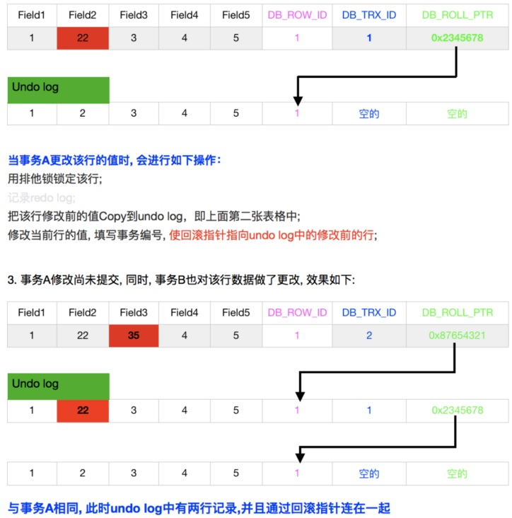
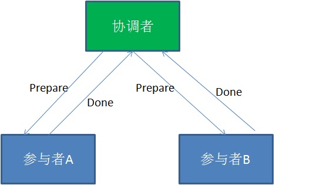
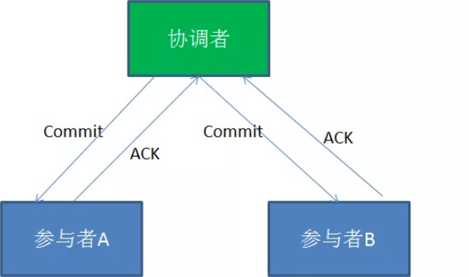
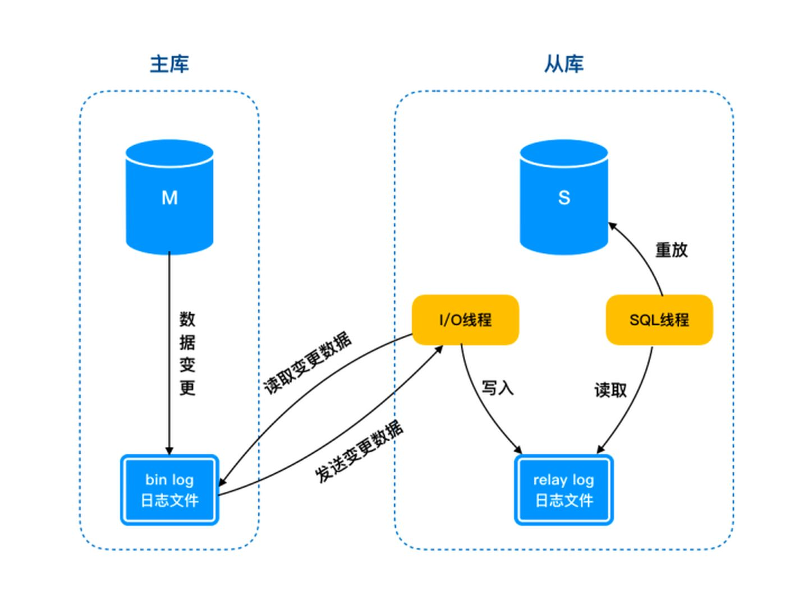

## 事务的ACID特性
- 事务（Transaction）是由一系列对系统中数据进行访问与更新的操作所组成的一个程序执行逻辑单元。事务是DBMS中最基础的单位，事务不可分割。
- 事务具有4个基本特征，分别是：原子性（Atomicity）、一致性（Consistency）、隔离性（Isolation）、持久性（Duration），简称ACID。
- 原子性：事务被视为不可分割的最小单元，事物的所有操作要不成功，要不失败回滚，而回滚可以通过日志来实现，日志记录着事务所执行的修改操作，在回滚时反向执行这些修改操作。（原子性实现原理 - Undo Log）
- 一致性：数据库在事务执行前后都保持一致性状态，在一致性状态下，所有事务对一个数据的读取结果都是相同的。
- 隔离性：一个事务所做的修改在最终提交以前，对其他事务是不可见的。（隔离性实现原理 - 锁）
- 持久性：一旦事务提交，则其所做的修改将会永远保存到数据库中。（持久性实现原理 - Redo Log）

## 隔离级别
- Read Uncommitted（读取未提交）：最低的隔离级别，什么都不需要做，一个事务可以读到另一个事务未提交的结果。所有的并发事务问题都会发生。
- Read Committed（读取提交内容）：只有在事务提交后，其更新结果才会被其他事务看见。可以解决脏读问题。
- Repeated Read（可重复读）：在一个事务中，对于同一份数据的读取结果总是相同的，无论是否有其他事务对这份数据进行操作，以及这个事务是否提交。可以解决脏读、不可重复读。
- Serialization（可串行化）：事务串行化执行，隔离级别最高，牺牲了系统的并发性。可以解决并发事务的所有问题。

```
脏读：一个事务还未提交，另外一个事务访问此事务修改的数据，并使用，读取了事务中间状态数据。
不可重复读：一个事务读取同一条记录2次，得到的结果不一致，由于在2次读取之间另外一个事务对此行数据进行了修改。
幻读：一个事务读取2次，得到的记录条数不一致，由于2次读取之间另外一个事务对数据进行了增删。
```
不同事务隔离级别有不同的效果：

| 隔离级别 | 脏读 | 不可重复读 | 幻读 |
|---|---|---|---|
| 读未提交 | √ | √ | √ |
| 读已提交 | × | √ | √ |
| 可重复读 | × | × | √ |
| 可串行化 | × | × | × |


## 数据库引擎InnoDB、MyISAM
- InnoDB是一个事务型的存储引擎，有行级锁定和外键约束。提供了对数据库ACID事务的支持，并且实现了SQL标准的四种隔离级别。
- MyISAM是MySQL默认的引擎，但是它没有提供对数据库事务的支持，也不支持行级锁和外键，因此当INSERT或UPDATE数据时即写操作需要锁定整个表，效率便会低一些。MyISAM中存储了表的行数。
- https://snailclimb.gitee.io/javaguide/#/docs/database/MySQL?id=myisam%e5%92%8cinnodb%e5%8c%ba%e5%88%ab

## MVCC实现原理
- Multi-Version Concurrency Control，即多版本并发控制。
- InnoDB 的 MVCC, 是通过在每行记录后面保存两个隐藏的列来实现的, 这两个列，分别保存了这个行的创建时间，一个保存的是行的删除时间。这里存储的并不是实际的时间值, 而是系统版本号 (可以理解为事务的 ID)，每次开始一个新的事务，系统版本号就会自动递增；当删除一条数据的时候，该数据的删除时间列就会存上当前事务的版本号 ；事务开始时刻的系统版本号会作为事务的 ID；
- https://juejin.cn/post/6844903986143690765
- https://segmentfault.com/a/1190000012650596

### InnoDB存储引擎在数据库每行数据的后面添加了三个字段
- 6字节的事务ID(DB_TRX_ID)字段: 用来标识最近一次对本行记录做修改(insert|update)的事务的标识符, 即最后一次修改(insert|update)本行记录的事务id。至于delete操作，在innodb看来也不过是一次update操作，更新行中的一个特殊位将行表示为deleted, 并非真正删除。
- 7字节的回滚指针(DB_ROLL_PTR)字段: 指写入回滚段(rollback segment)的 undo log record (撤销日志记录记录)。如果一行记录被更新, 则 undo log record 包含 '重建该行记录被更新之前内容' 所必须的信息。
- 6字节的DB_ROW_ID字段: 包含一个随着新行插入而单调递增的行ID, 当由innodb自动产生聚集索引时，聚集索引会包括这个行ID的值，否则这个行ID不会出现在任何索引中。结合聚簇索引的相关知识点, 我的理解是, 如果我们的表中没有主键或合适的唯一索引, 也就是无法生成聚簇索引的时候, InnoDB会帮我们自动生成聚集索引, 但聚簇索引会使用DB_ROW_ID的值来作为主键; 如果我们有自己的主键或者合适的唯一索引, 那么聚簇索引中也就不会包含 DB_ROW_ID 了

### 案例分析


### 小结
- 一般我们认为MVCC有下面几个特点：
    - 每行数据都存在一个版本，每次数据更新时都更新该版本
    - 修改时Copy出当前版本, 然后随意修改，各个事务之间无干扰
    - 保存时比较版本号，如果成功(commit)，则覆盖原记录, 失败则放弃copy(rollback)
    - 就是每行都有版本号，保存时根据版本号决定是否成功，听起来含有乐观锁的味道, 因为这看起来正是，在提交的时候才能知道到底能否提交成功
- 而InnoDB实现MVCC的方式是:
    - 事务以排他锁的形式修改原始数据
    - 把修改前的数据存放于undo log，通过回滚指针与主数据关联
    - 修改成功（commit）啥都不做，失败则恢复undo log中的数据（rollback）
    - 二者最本质的区别是: 当修改数据时是否要排他锁定，如果锁定了还算不算是MVCC？
    - Innodb的实现真算不上MVCC, 因为并没有实现核心的多版本共存, undo log 中的内容只是串行化的结果, 记录了多个事务的过程, 不属于多版本共存。但理想的MVCC是难以实现的, 当事务仅修改一行记录使用理想的MVCC模式是没有问题的, 可以通过比较版本号进行回滚, 但当事务影响到多行数据时, 理想的MVCC就无能为力了。
    - 比如, 如果事务A执行理想的MVCC, 修改Row1成功, 而修改Row2失败, 此时需要回滚Row1, 但因为Row1没有被锁定, 其数据可能又被事务B所修改, 如果此时回滚Row1的内容，则会破坏事务B的修改结果，导致事务B违反ACID。 这也正是所谓的 第一类更新丢失 的情况。
    - 也正是因为InnoDB使用的MVCC中结合了排他锁, 不是纯的MVCC, 所以第一类更新丢失是不会出现了, 一般说更新丢失都是指第二类丢失更新。

## 数据库索引及底层实现
- 唯一索引：唯一索引是在表上一个或者多个字段组合建立的索引，这个或者这些字段的值组合起来在表中不可以重复
- 非唯一索引：非唯一索引是在表上一个或者多个字段组合建立的索引，这个或者这些字段的值组合起来在表中可以重复，不要求唯一。
- 主键索引（主索引）：主键索引（主索引）是唯一索引的特定类型。表中创建主键时自动创建的索引 。一个表只能建立一个主索引。
- 聚集索引/非聚集索引：聚集索引（聚簇索引），表中记录的物理顺序与键值的索引顺序相同。一个表只能有一个聚集索引。InnoDB 使用 B+ 树，既可以保存实际数据，也可以加速数据搜索，这就是聚簇索引
- 聚集索引：https://veal98.gitee.io/cs-wiki/#/%E8%AE%A1%E7%AE%97%E6%9C%BA%E5%9F%BA%E7%A1%80/%E6%95%B0%E6%8D%AE%E5%BA%93/%E9%9D%A2%E8%AF%95%E6%8C%87%E5%8D%97?id=_6-%e8%81%9a%e9%9b%86%e7%b4%a2%e5%bc%95%e4%b8%8e%e9%9d%9e%e8%81%9a%e9%9b%86%e7%b4%a2%e5%bc%95

## 分布式事务
https://mp.weixin.qq.com/s?__biz=MzIxMjE5MTE1Nw==&mid=2653193461&idx=1&sn=d69ccec780ae6d3b0c722cf09fa154d1&chksm=8c99f62fbbee7f39cd221bd0ecc9105a5c16e353d82d2407e7f295da9f9172cfd4889d3f12c8&scene=21#wechat_redirect)
- 分布式事务用于在分布式系统中保证不同节点之间的数据一致性。
- 分布式事务的实现有很多种，最具有代表性的是由Oracle Tuxedo系统提出的XA分布式事务协议。
- XA协议包含两阶段提交（2PC）和三阶段提交（3PC）两种实现，这里我们重点介绍两阶段提交的具体过程。
- 事务的发起者称协调者，事务的执行者称参与者。

- 第一阶段：
    - 在XA分布式事务的第一阶段，作为事务协调者的节点会首先向所有的参与者节点发送Prepare请求。
    - 在接到Prepare请求之后，每一个参与者节点会各自执行与事务有关的数据更新，写入Undo Log和Redo Log。如果参与者执行成功，暂时不提交事务，而是向事务协调节点返回“完成”消息。
    - 当事务协调者接到了所有参与者的返回消息，整个分布式事务将会进入第二阶段。

- 第二阶段：
    - 在XA分布式事务的第二阶段，如果事务协调节点在之前所收到都是正向返回，那么它将会向所有事务参与者发出Commit请求。
    - 接到Commit请求之后，事务参与者节点会各自进行本地的事务提交，并释放锁资源。当本地事务完成提交后，将会向事务协调者返回“完成”消息。
    - 当事务协调者接收到所有事务参与者的“完成”反馈，整个分布式事务完成。
- XA两阶段提交的不足：
    - 1.性能问题：XA协议遵循强一致性。在事务执行过程中，各个节点占用着数据库资源，只有当所有节点准备完毕，事务协调者才会通知提交，参与者提交后释放资源。这样的过程有着非常明显的性能问题。
    - 2.协调者单点故障问题：事务协调者是整个XA模型的核心，一旦事务协调者节点挂掉，参与者收不到提交或是回滚通知，参与者会一直处于中间状态无法完成事务。
    - 3.丢失消息导致的不一致问题：在XA协议的第二个阶段，如果发生局部网络问题，一部分事务参与者收到了提交消息，另一部分事务参与者没收到提交消息，那么就导致了节点之间数据的不一致。
- 如何避免XA两阶段提交的种种问题呢？有许多其他的分布式事务方案可供选择：
    - 1.XA三阶段提交：XA三阶段提交在两阶段提交的基础上增加了CanCommit阶段，并且引入了超时机制。一旦事物参与者迟迟没有接到协调者的commit请求，会自动进行本地commit。这样有效解决了协调者单点故障的问题。但是性能问题和不一致的问题仍然没有根本解决。CanCommit、PreCommit、DoCommit
    - 2.MQ事务：利用消息中间件来异步完成事务的后一半更新，实现系统的最终一致性。这个方式避免了像XA协议那样的性能问题。
    - 3.TCC事务：TCC事务是Try、Commit、Cancel三种指令的缩写，其逻辑模式类似于XA两阶段提交，但是实现方式是在代码层面来人为实现。


## 缓存穿透、击穿、雪崩
- 缓存穿透是指缓存和数据库中都没有的数据，而用户（黑客）不断发起请求
- 缓存击穿是指一个Key非常热点，在不停地扛着大量的请求，大并发集中对这一个点进行访问，当这个Key在失效的瞬间，持续的大并发直接落到了数据库上，就在这个Key的点上击穿了缓存。
- 缓存雪崩是因为大面积的缓存失效，打崩了DB

## mysql主从复制
https://zhuanlan.zhihu.com/p/342666786

- 主从复制原理：主从复制中有两个很重要的日志文件，binlog和relay log，分别位于主库与从库中。其中 binlog 是主从复制的基础，通过将操作事件写入 binlog 通过 I/O 线程传送至从库进行同步。
- 主从延迟原因：
    - 从库中 SQL 线程重放的过程是随机写盘的，并且 SQL 线程是单线程的，因此数据来不及重放的话就会导致主从延迟。
    - 主库并发高会导致写操作不断写入 binlog，对于 SQL 线程说可能会应接不暇，也会产生主从延迟。
    - 重放过程中如果遇到锁等待也是产生延迟的原因之一。
- 主从延迟处理：MySQL 5.6版本以后通过并行复制的方式来解决 SQL 单线程产生的主从延迟问题。对于低版本来说，可以通过降低主库的并发来解决。如果对数据实时性要求比较严格的话，可以通过读主库来达到目的。


## MySQL日记系统redo log、binlog、undo log
- 物理日志redo log和逻辑日志binlog
- redo log是InnoDB引擎特有的；binlog是MySQL的Server层实现的，所有引擎都可以使用。
- redo log是物理日志，记录的是“在某个数据页上做了什么修改”；binlog是逻辑日志，记录的是这个语句的原始逻辑，比如“给ID=2这一行的c字段加1 ”。
- redo log是循环写的，空间固定会用完；binlog是可以追加写入的。“追加写”是指binlog文件写到一定大小后会切换到下一个，并不会覆盖以前的日志。


## 数据库高并发解决方法
1、查询优化
    - 尽量减少对数据库的访问次数
    - 尽量减少对表的访问行数,最小化结果集
    - 能够分开的操作尽量分开处理，提高每次的响应速度
    - 在数据窗口使用SQL时，尽量把使用的索引放在选择的首列
    - 在查询时，不要过多地使用通配符如SELECT * FROM T1语句，要用到几列就选择几列
    - 在可能的情况下尽量限制尽量结果集行数
2、部署优化：分库分表

## 慢查询日志
慢查询日志是将mysql服务器中影响数据库性能的相关SQL语句记录到日志文件，通过对这些特殊的SQL语句分析，改进以达到提高数据库性能的目的。
- 通过使用--slow_query_log[={0|1}]选项来启用慢查询日志。所有执行时间超过long_query_time秒的SQL语句都会被记录到慢查询日志。
- 缺省情况下hostname-slow.log为慢查询日志文件安名，存放到数据目录，同时缺省情况下未开启慢查询日志。
- 缺省情况下数据库相关管理型SQL(比如OPTIMIZE TABLE、ANALYZE TABLE和ALTER TABLE)不会被记录到日志。
- 可以使用mysqldumpslow命令获得日志中显示的查询摘要来处理慢查询日志。

## 如何优化SQL
- 加索引
- 避免返回不必要的数据
- 适当分批量返回
- 分库分表、读写分离