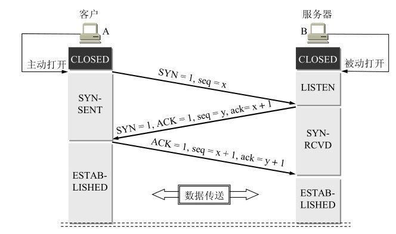
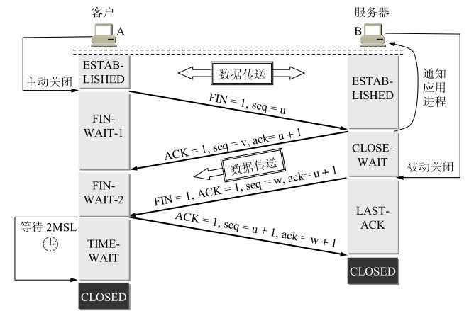
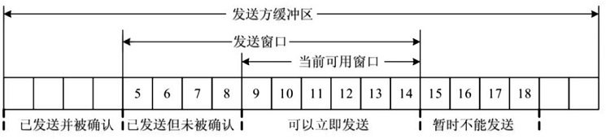
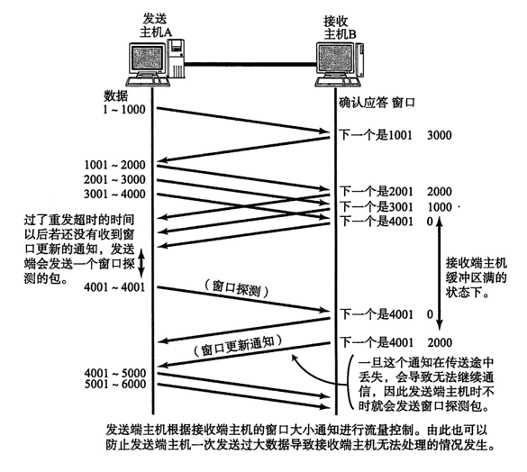
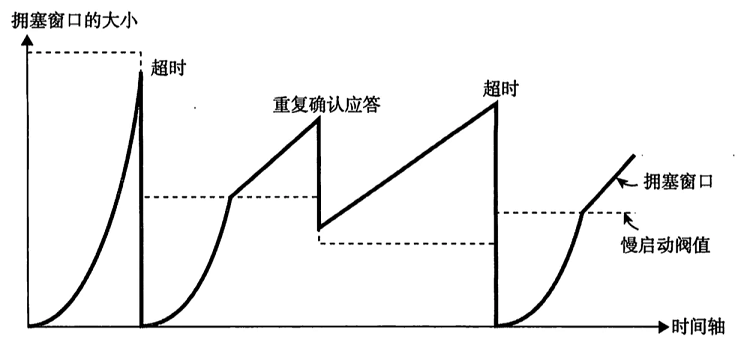
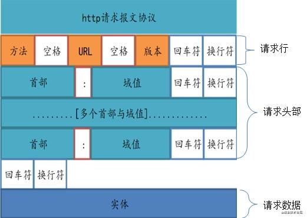
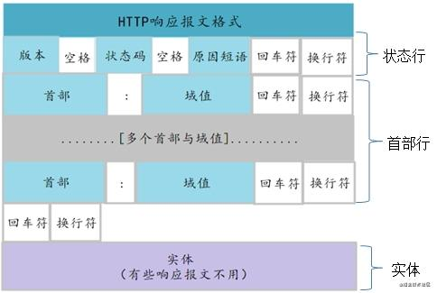

**<center>TCP报文格式</center>**

## 1、OSI七层模型、TCP/IP四层

|OSI七层模型|TCP/IP模型|功能|TCP/IP协议族|
|---|---|---|---|
| 应用层 | 应用层 | 文件传输，电子邮件，文件服务，虚拟终端 | TFTP,HTTP:80,SNMP,FTP:21,SMTP:25,DNS:53,Telnet |
| 表示层 |  | 数据格式化，代码转换，数据加密 | 没有协议 |
| 会话层 |  | 接触或建立别的节点的联系 | 没有协议 |
| 传输层 | 传输层 | 提供端对端的接口 | TCP,UDP |
| 网络层 | 网络层 | 为数据选择路由 | IP,ICMP,RIP,OSPF,BGP,IGMP |
| 数据链路层 | 链路层 | 传输有地址的帧以及错误检测功能 | SLIP,CSLIP,PPP,ARP,RARP,MTU |
| 物理层 |  | 以二进制数据形式在物理媒体上传输数据 | ISO2110,IEEE802,IEEE802.2 |

什么是四层模型
- 第一层：应用层，主要有负责web浏览器的HTTP协议， 文件传输的FTP协议，负责电子邮件的SMTP协议，负责域名系统的DNS等。
- 第二层：传输层，主要是有可靠传输的TCP协议，特别高效的UDP协议。主要负责传输应用层的数据包。
- 第三层：网络层，主要是IP协议。主要负责寻址（找到目标设备的位置）
- 第四层：数据链路层，主要是负责转换数字信号和物理二进制信号。

## 2、TCP和UDP区别
| | UDP | TCP |
|---|---|---|
| 是否连接 | 无连接 | 面向连接 |
| 是否可靠 | 不可靠传输，不使用流量控制和拥塞控制 | 可靠传输，使用流量控制和拥塞控制 |
| 连接对象个数 | 支持一对一，一对多，多对一和多对多交互通信 | 只能是一对一通信 |
| 传输方式 | 面向报文 | 面向字节流 |
| 首部开销 | 首部开销小，仅8字节 | 首部最小20字节，最大60字节 |
| 适用场景 | 适用于实时应用（IP电话、视频会议、直播等） | 适用于要求可靠传输的应用，例如文件传输 |

## 3、TCP协议3次握手、4次挥手


**<center>TCP协议3次握手</center>**

三次握手最主要的目的就是**双方确认自己与对方的发送与接收是正常的**

### 3.1、TCP连接建立需要为什么不是两次握手
- 为什么A还要发送一次确认呢？<u>这主要是为了防止已失效的连接请求报文段突然又传送到了B，因而产生错误</u>。
- 所谓“已失效的连接请求报文段”是这样产生的。考虑一种正常情况。A发出连接请求，但因连接请求报文丢失而未收到确认。于是A再重传一次连接请求。后来收到了确认，建立了连接。数据传输完毕后，就释放了连接。A共发送了两个连接请求报文段，其中第一个丢失，第二个到达了B。没有“已失效的连接请求报文段”。
- 现假定出现一种异常情况，即<u>A发出的第一个连接请求报文段并没有丢失，而是在某些网络结点长时间滞留了，以致延误到连接释放以后的某个时间才到达B</u>。本来这是一个早已失效的报文段。但B收到此失效的连接请求报文段后，就误认为是A又发出一次新的连接请求。于是就向A发出确认报文段，同意建立连接。假定不采用三次握手，那么只要B发出确认，新的连接就建立了。
- 由于现在A并没有发出建立连接的请求，因此不会理睬B的确认，也不会向B发送数据。但B却以为新的运输连接已经建立了，并一直等待A发来数据。B的许多资源就这样白白浪费了。
- 采用三次握手的办法可以防止上述现象的发生。例如在刚才的情况下，A不会向B的确认发出确认。B由于收不到确认，就知道A并没有要求建立连接。

### 3.2、TCP第三次握手失败会出现什么
- 失败时会超时重传SYN+ACK，重传次数根据 `/proc/sys/net/ipv4/tcp_synack_retries` 来指定，默认是5次。如果重传指定次数到了后，仍然未收到ACK应答，会给客户端发RST报文，进入CLOSED状态，这个时候客户端应该也会关闭连接。

### 3.3、TCP四次挥手

**<center>TCP协议4次挥手</center>**

- **CLOSE-WAIT 状态问题**：客户端发送了 FIN 连接释放报文之后，服务器收到了这个报文，就进入了 CLOSE-WAIT 状态。这个状态是为了让服务器端发送还未传送完毕的数据，传送完毕之后，服务器会发送FIN 连接释放报文。
- **A收到B的FIN报文后，后进入到TIME-WAIT（时间等待）状态**。请注意，现在TCP连接还没有释放掉。必须经过时间等待计时器(TIME-WAIT timer)设置的时间2MSL后，A才进入到CLOSED状态。时间<u>MSL叫做最长报文段寿</u>命(Maximum Segment Lifetime)，RFC 793建议设为2分钟。但这完全是从工程上来考虑，对于现在的网络，MSL = 2分钟可能太长了一些。因此TCP允许不同的实现可根据具体情况使用更小的MSL值。因此，从A进入到TIME-WAIT状态后，要经过4分钟才能进入到CLOSED状态，才能开始建立下一个新的连接。当A撤销相应的传输控制块TCB后，就结束了这次的TCP连接。

```
TIME_WAIT调优
#表示开启SYN Cookies。当出现SYN等待队列溢出时，启用cookies来处理，可防范少量SYN攻击，默认为0，表示关闭
net.ipv4.tcp_syncookies = 1
#表示开启重用。允许将TIME-WAIT sockets重新用于新的TCP连接，默认为0，表示关闭
net.ipv4.tcp_tw_reuse = 1
#表示开启TCP连接中TIME-WAIT sockets的快速回收，默认为0，表示关闭
net.ipv4.tcp_tw_recycle = 1
#表示如果套接字由本端要求关闭，这个参数决定了它保持在FIN-WAIT-2状态的时间
net.ipv4.tcp_fin_timeout=30

TIME_WAIT：表示主动关闭，通过优化系统内核参数可容易解决。
CLOSE_WAIT：表示被动关闭，需要从程序本身出发。
ESTABLISHED：表示正在通信
```

- <u>**为什么A在TIME-WAIT状态必须等待2MSL的时间呢？这有两个理由。**</u>
- 第一，<u>为了保证A发送的最后一个ACK报文段能够到达B</u>。这个ACK报文段有可能丢失，因而使处在LAST-ACK状态的B收不到对已发送的FIN + ACK报文段的确认。B会超时重传这个FIN + ACK报文段，而A就能在2MSL时间内收到这个重传的FIN + ACK报文段。接着A重传一次确认，重新启动2MSL计时器。最后，A和B都正常进入到CLOSED状态。如果A在TIME-WAIT状态不等待一段时间，而是在发送完ACK报文段后立即释放连接，那么就无法收到B重传的FIN + ACK报文段，因而也不会再发送一次确认报文段。这样，B就无法按照正常步骤进入CLOSED状态。
- 第二，防止上一节提到的“已失效的连接请求报文段”出现在本连接中。A在发送完最后一个ACK报文段后，再经过时间2MSL，就可以使本连接持续的时间内所产生的所有报文段都从网络中消失。这样就可以使下一个新的连接中不会出现这种旧的连接请求报文段。
- B只要收到了A发出的确认，就进入CLOSED状态。同样，B在撤销相应的传输控制块TCB后，就结束了这次的TCP连接。我们注意到，B结束TCP连接的时间要比A早一些。

### 3.4、2MSL(Maximum Segment Lifetime)意义
- 1、保证最后一次ACK报文能到服务端，能进行超时重传。
- 2、2MSL后，这次连接的所有报文都会消失，不会影响下一次连接。


## 4、TCP长连接和短链接及优缺点
- 所谓长连接，指在一个TCP连接上可以连续发送多个数据包，在TCP连接保持期间，如果没有数据包发送，需要双方发检测包以维持此连接，一般需要自己做在线维持（不发生RST包和四次挥手）。
- 短连接是指通信双方有数据交互时，就建立一个TCP连接，数据发送完成后，则断开此TCP连接（管理起来比较简单，存在的连接都是有用的连接，不需要额外的控制手段）；
- tcp长连接优缺点：长连接可以省去较多的tcp建立/关闭的操作，减少浪费，节省时间，对于频繁请求资源的客户，较适用于长连接；client和server如果长时间不关闭的话，会存在一个问题，随着客户的越来越多，server早晚会有扛不住的一天，这时需要采取一些策略，如关闭一些长时间不读写操作的连接，这样可以避免一些恶意连接导致server端服务受损，如果条件再允许，就可以以客户端为颗粒度，限制每个客户端的最大连接数
- tcp短连接优缺点：短连接对于服务器来说较为简单，存在的连接都是有用的连接，不需要额外的控制，但如果客户端连接频繁，会在tcp的建立和关闭上浪费时间。


## 5、TCP如何保证可靠性
https://juejin.im/post/6861491957534261255

### 5.1、差错控制
- 差错控制的方法有：**校验和、确认应答、重传** 三种
- TCP 通过首部中的校验和字段，判断数据是否损坏，如果损坏，则直接丢弃。
- 在 TCP 中，发送端的数据到达接收端时，接收端会返回一个“我收到消息了”的通知，这个通知就是确认应答（ACK, Acknowledge character）。
- TCP共实现了两种重传机制：超时重传和快重传

#### 5.1.1、超时重传
- 当发送端发送数据后，如果在特定时间间隔内还没有收到 ACK，就会进行超时重传。特定时间：`RTT` + 偏差值，Round Trip Time 报文段的往返时间，如果网络稳定性较差，那么相应的偏差值也会较大，相反的，若网络比较稳定，则偏差值也会较小。
- 由于最初的数据包还不知道其 `RTT`，所以其超时重传时间一般设置为 6秒。

#### 5.1.2、快重传
- 快重传基于窗口控制（后面会讲到），是指发送端在连续三次收到同一个确认应答后，就会将其对应的数据进行重发，这种机制比超时重传更加高效。

### 5.2、流量控制
- 所谓流量控制(flow control)就是让发送方的发送速率不要太快，要让接收方来得及接收。
- TCP 以一个段为单位，每发送一个段就要进行一次确认应答（ACK）处理，这样传输的方式有一个缺点，就是包的往返时间越长，效率就越低。
- 所以 TCP 引入了 窗口 这个概念，在窗口范围内，即使没有收到 ACK，也可以继续发送数据，无需一直等待 ACK，这个机制的实现使用了大量的缓冲区。
- 通过流量控制，发送端需要根据接收端的实际接收能力控制发送的数据量。
- **利用滑动窗口实现流量控制**，滑动窗口以字节为单位。
- TCP 首部中带有窗口大小字段，在返回 ACK 时，就会带上这个字段，接收端接收到了这个字段后，就对会自己的窗口大小进行更新（滑动）


**<center>滑动窗口</center>**


**<center>滑动窗口发送</center>**

### 5.3、拥塞控制

**<center>慢开始与拥塞避免算法</center>**

**<center>拥塞窗口大小</center>**
- **拥塞**是由于网络中的路由器由于超载而引起的严重延迟现象，拥塞的发生会造成数据丢失，进而引发超时重传，而超时重传又会进一步加剧拥塞，如果不进行控制，最终会导致整个网络的瘫痪。
- 拥塞控制主要通过利用发送窗口限制数据流的速度，减缓注入网络的数据流量后，拥塞自然就会解除。
- 而起关键作用的发送窗口的大小，取决于两个因素，一个是接收窗口的大小，另一个就是拥塞窗口。
- **慢启动**：定义拥塞窗口，一开始将该窗口大小设为1MSS（1460字节），之后每次收到确认应答（经过一个rtt），将拥塞窗口大小*2
- **拥塞避免**：设置慢启动阈值（ssthresh），一般开始都设为65535字节。拥塞避免是指当拥塞窗口大小达到这个阈值，拥塞窗口的值不再指数上升，而是加法增加（每次确认应答/每个rtt，拥塞窗口大小+1MSS），以此来避免拥塞。
- **拥塞检测**：超时重传或连续收到三个相同的 `ACK`，则认为发生拥塞。
    - 一旦发生超时重传，我们需要先将**慢启动阈值**设为当前窗口大小的一半，并且将拥塞窗口大小设置为1MSS，然后重新进入慢启动阶段。
    - 如果连续收到了三个相同的 `ACK`，将慢启动阀值设为当前窗口的一半，拥塞窗口设置为慢启动阀值+3。

## 6、TCP如何解决粘包、拆包问题
- 消息数据定长，比如定长100字节
- 消息数据使用特定分割符区分界限，比如使用换号符号做分割
- 把消息数据分成消息头和消息体，消息头带消息的长度，接收方收到后根据消息头中的长度解析数据。

## 7、UDP如何实现TCP可靠传输
- 1、添加seq/ack机制，确保数据发送到对端
- 2、添加发送和接收缓冲区，主要是用户超时重传。
- 3、添加超时重传机制。

## 8、ARP
### ARP解析过程
- ARP地址解析协议，将IP地址解析为MAC地址。
- 主机发送信息时将包含目标IP地址的ARP请求广播到网络上的所有主机，并接收返回消息，以此确定目标的物理地址；收到返回消息后将该IP地址和物理地址存入本机ARP缓存中并保留一定时间，下次请求时直接查询ARP缓存以节约资源。
- 为了确定目标的MAC地址，首先查找ARP缓存表。如果要查找的MAC地址不在表中，ARP会发送一个广播，从而发现目的地的MAC地址，并记录到ARP缓存表中以便下次查找。

### ARP协议
- 将ip地址解析到mac地址。
- 目标IP与自己在同一网段：
    - arp高速缓存有目标IP的MAC地址：直接发送到该物理地址
    - arp高速缓存没有目标IP的MAC地址：发送ARP广播请求目标IP的MAC地址，缓存该MAC地址，然后发数据报到该MAC地址。
- 目标IP与自己不在同一个网段：这种情况需要将包发给默认网关，所以主要获取网关的MAC地址
    - arp高速缓存有默认网关的MAC地址：直接发送IP数据报道默认网关，再由网关转发到外网。
    - arp高速缓存没有默认网关的MAC地址 ：还是发送ARP广播请求默认网关的MAC地址，缓存该地址，并且发送数据报到网关。

## 9、DNS原理

### 9.1、DNS解析过程
(https://www.jianshu.com/p/189311c71b0e)
- 浏览器缓存：查看浏览器缓存的域名与IP的映射关系，如果有则解析成功。
- 主机缓存：浏览器缓存没命中，查询主机DNS缓存。
- LDNS（本地域名服务器）：本机缓存没命中，则查找本地域名服务器。
- Root Server：LDNS没有查到，就会发送请求到Root Server。Root Server不直接解析域名，它会返回所查询域的gTLD地址。
- gTLD服务器：gTLD为国际顶级域名服务器，如 .com，.cn，.org都由它管理。LDNS发送请求到gTLD，gTLD返回对应域名的Name Server服务器地址。
- Name Server（域名服务器）：Name Server为域名提供商的域名解析服务器。域名最终在这里解析，上述步骤要么是缓存，要么是提供域名解析服务器地址。想想也挺合理，在哪买的域名就在哪绑定IP。
- DNS劫持：在DNS服务器中，将 `www.xxx.com` 的域名对应的IP地址进行了变化。你解析出来的 域名对应的IP，在劫持前后不一样。
- DNS劫持：域名劫持是互联网攻击的一种方式，通过攻击域名解析服务器（DNS），或伪造域名解析服务器（DNS）的方法，把目标网站域名解析到错误的IP地址从而实现用户无法访问目标网站的目的或者蓄意或恶意要求用户访问指定IP地址（网站）的目的。

### 9.2、DNS使用TCP还是UDP
- DNS在区域传输的时候使用TCP协议,其他时候使用UDP协议。
- DNS同时占用TCP和UDP的53号端口。
- 因为查询很频繁，使用UDP报文给服务器带来的负担小，所以查询的时候使用的是UDP报文。
- 主副DNS进行区域传送的时候，用TCP，因为要保证数据的准确性。
- DNS区域传输的时候使用TCP协议：
    - 1.辅域名服务器会定时（一般3小时）向主域名服务器进行查询以便了解数据是否有变动。如有变动，会执行一次区域传送，进行数据同步。区域传送使用TCP而不是UDP，因为数据同步传送的数据量比一个请求应答的数据量要多得多。
    - 2.TCP是一种可靠连接，保证了数据的准确性。
- 域名解析时使用UDP协议：
    - 客户端向DNS服务器查询域名，一般返回的内容都不超过512字节，用UDP传输即可。不用经过三次握手，这样DNS服务器负载更低，响应更快。理论上说，客户端也可以指定向DNS服务器查询时用TCP，但事实上，很多DNS服务器进行配置的时候，仅支持UDP查询包。

## 10、HTTP常见问题
(https://mp.weixin.qq.com/s/amOya0M00LwpL5kCS96Y6w)

- HTTP 是超文本传输协议，也就是HyperText Transfer Protocol
- HTTP 常见的状态码，有哪些？
    - 1xx 类状态码属于提示信息
    - 2xx 类状态码表示服务器成功处理了客户端的请求。`200 OK`
    - 3xx 类状态码表示客户端请求的资源发送了变动，需要客户端用新的 URL 重新发送请求获取资源，也就是重定向。`301 Moved Permanently`
    - 4xx 类状态码表示客户端发送的报文有误。`400 Bad Request、403 Forbidden、404 Not Found`
    - 5xx 类状态码表示客户端请求报文正确，但是服务器处理时内部发生了错误，属于服务器端的错误码。`500 Internal Server Error、501 Not Implemented、502 Bad Gateway、503 Service Unavailable`
- HTTP 常见字段有：Host、Content-Length、Connection、Content-Type、Content-Encoding、
- **GET 和 POST 的区别？**
    - Get 方法的含义是请求从服务器获取资源，这个资源可以是静态的文本、页面、图片视频等。
    - POST 向 URI 指定的资源提交数据，数据就放在报文的 body 里。
    - GET 方法就是安全且幂等，POST是不安全的，不是幂等的
- HTTP 最突出的优点是「简单、灵活和易于扩展、应用广泛和跨平台」，缺点是无状态、明文传输、不安全（通信使用明文（不加密），内容可能会被窃听；不验证通信方的身份，因此有可能遭遇伪装；无法证明报文的完整性，所以有可能已遭篡改）。
- HTTP 的安全问题，可以用 HTTPS 的方式解决，也就是通过引入 SSL/TLS 层，使得在安全上达到了极致
- HTTP/1.1 提出了长连接的通信方式，减少了 TCP 连接的重复建立和断开所造成的额外开销，减轻了服务器端的负载。
- HTTP/1.1 相比 HTTP/1.0 性能上的改进：
    - 使用 TCP 长连接的方式改善了 HTTP/1.0 短连接造成的性能开销。
    - 支持 管道（pipeline）网络传输，只要第一个请求发出去了，不必等其回来，就可以发第二个请求出去，可以减少整体的响应时间。



```
POST /index.html HTTP/1.1
HOST: www.XXX.com
User-Agent: Mozilla/5.0(Windows NT 6.1;rv:15.0) Firefox/15.0

Username=admin&password=admin
```



```
HTTP/1.1 200 OK
Content-Encoding: gzip
Content-Type: text/html;charset=utf-8

<!DOCTYPE html>
<html lang="en">
<head>
    <meta charset="UTF-8" />
    <title>Document</title>
</head>
<body>
    <p>this is http response</p>
</body>
</html>
```
- HTTP有两种报文：请求报文和响应报文。
    - HTTP请求报文主要包括请求行、请求头部以及请求的数据（实体）三部分
        - 请求行（HTTP请求报文的第一行）：请求行由方法字段、URL字段和HTTP协议版本字段。其中，方法字段严格区分大小写，当前HTTP协议中的方法都是大写，方法字段如下介绍如下：
        - 请求头部：位于请求行的下面, 是一个个的key-value值
        - 空行(CR+LF)：请求报文用空行表示header和请求数据的分隔
        - 请求数据：GET方法没有携带数据， POST方法会携带一个body
    - HTTP的响应报文包括：状态行，响应头部，相应的数据(响应体)
        - 状态行包括：HTTP版本号，状态码和状态值组成。
        - 响应头类似请求头，是一系列key-value值
        - 空白行：同上，响应报文也用空白行来分隔header和数据
        - 响应体：响应的数据

## 11、什么是 HTTPS 协议
- https://segmentfault.com/a/1190000012196642
- http://mp.weixin.qq.com/s?__biz=MzIxMjE5MTE1Nw==&mid=2653197101&idx=1&sn=d1fe482561d3d079363032ec182c5b3b&chksm=8c99e1f7bbee68e10f8470453637a7d434751a9414ceeffbbb9601f5ae2ba64e26fa6a88a99b&scene=21#wechat_redirect
- SSL（Secure Socket Layer，安全套接字层）
- TLS（Transport Layer Security，传输层安全）

### 对称加密算法和非对称加密算法
- HTTPS在加密过程中使用了非对称加密技术和对称加密技术。
- **对称加密算法**：又称共享密钥加密算法，指加密和解密使用相同密钥的加密算法。对称加密算法用来对敏感数据等信息进行加密，常用的算法包括DES、3DES、AES、DESX、Blowfish、RC4、RC5、RC6。
- **非对称加密算法**：指加密和解密使用不同密钥的加密算法，也称为公私钥加密/公开密钥加密算法。假设两个用户要加密交换数据，双方交换公钥，使用时一方用对方的公钥加密，另一方即可用自己的私钥解密。常见的非对称加密算法：RSA、DSA（数字签名用）、ECC（移动设备用）、Diffie-Hellman、El Gamal。
    - 当客户端第一次发请求和服务器协商的时候，服务器就生成了一对公钥和私钥。
    - 紧接着，服务器把公钥发给客户端（明文，不需要做任何加密），客户端接收后，随机生成一个密钥，使用服务器发过来的公钥进行加密。
    - 再接着，客户端把使用公钥加密的密钥发给服务器，服务器接收到了以后，用配对的私钥进行解密，就得到了客户端随机生成的那个密钥。
    - 这个时候，客户端和服务端所持的密钥都是相同的。此时，交换密钥环节就完成了。
    - 于是通信开始时就可进行共享密钥加密方式来进行加密。
- HTTPS采用共享密钥加密和公开密钥加密两者并用的混合加密机制。在交换密钥使用环节使用公开密钥加密方式，之后建立的通信交换报文阶段则使用共享密钥加密方式。
- **如何保证服务器传过来的公开密钥的正确性**。换句话说，就是保证它不被拦截篡改。
    - **使用证书保证公钥的正确性**
    - 首先，服务器的运营人员向数字证书机构提出公开密钥的申请。数字证书认证机构在判明提出申请者的身份之后，会对已申请的公开密钥做数字签名，然后分配这个已签名的公开密钥，并将该公开密钥放入公钥证书后绑定在一起。
    - 接下来，服务器会把这份由数字证书认证机构颁发的公钥证书发给客户端。这个时候，客户端可以使用数字证书机构的公开密钥对其进行验证。一旦验证成功，客户端便能够确定这个公开密钥是可信的。
    - CA除了给申请者发布证书，它自己本身也有自己的证书。CA自身的数字证书（一般由它自己生成）在我们操作系统刚安装好的时候，这些CA自身的数字证书就已经被微软（或者其它操作系统的开发机构）安装在操作系统中了。而CA的公钥就包含在其中。这样，CA就可以通过自身的私钥对发布的数字证书进行签名，而在客户端就能够用对应的公钥来对其进行解密。

## 12、HTTP和HTTPS区别
### 12.1、HTTP和HTTPS区别：
- 1）HTTP 是超文本传输协议，信息是明文传输，存在安全风险的问题。HTTPS 则解决 HTTP 不安全的缺陷，在 TCP 和 HTTP 网络层之间加入了 SSL/TLS 安全协议，使得报文能够加密传输。
- 2）HTTP 连接建立相对简单， TCP 三次握手之后便可进行 HTTP 的报文传输。而 HTTPS 在 TCP 三次握手之后，还需进行 SSL/TLS 的握手过程，才可进入加密报文传输。
- 3）HTTP 的端口号是 80，HTTPS 的端口号是 443。
- 4）HTTPS 协议需要向 CA（证书权威机构）申请数字证书，来保证服务器的身份是可信的。

### 12.2、HTTPS优点：
- HTTPS传输数据过程中使用密钥进行加密，所以安全性更高。（HTTPS 采用的加密方式: HTTPS 采用混合的加密机制。所有传输的内容都经过加密，加密采用对称加密，但对称加密的密钥用服务器方的证书进行了非对称加密。）
- HTTPS协议可以认证用户和服务器，确保数据发送到正确的用户和服务器

### 12.3、HTTPS缺点：
- HTTPS握手阶段延时较高：由于在进行HTTP会话之前还需要进行SSL握手，因此HTTPS协议握手阶段延时增加
- HTTPS部署成本高：一方面HTTPS协议需要使用证书来验证自身的安全性，所以需要购买CA证书；另一方面由于采用HTTPS协议需要进行加解密的计算，占用CPU资源较多，需要的服务器配置或数目高

## 13、HTTP1.0、HTTP1.1、HTTP2.0区别

### 13.1、HTTP1.0 和 HTTP1.1 的区别
- **长连接**(Persistent Connection)：HTTP1.1支持长连接和请求的流水线处理，在一个TCP连接上可以传送多个HTTP请求和响应，减少了建立和关闭连接的消耗和延迟，在HTTP1.1中默认开启长连接keep-alive，一定程度上弥补了HTTP1.0每次请求都要创建连接的缺点。HTTP1.0需要使用keep-alive参数来告知服务器端要建立一个长连接。
- **节约带宽**：HTTP1.0中存在一些浪费带宽的现象，例如客户端只是需要某个对象的一部分，而服务器却将整个对象送过来了，并且不支持断点续传功能。HTTP1.1支持只发送header信息（不带任何body信息），如果服务器认为客户端有权限请求服务器，则返回100，客户端接收到100才开始把请求body发送到服务器；如果返回401，客户端就可以不用发送请求body了节约了带宽。
- **HOST域**：在HTTP1.0中认为每台服务器都绑定一个唯一的IP地址，因此，请求消息中的URL并没有传递主机名（hostname），HTTP1.0没有host域。随着虚拟主机技术的发展，在一台物理服务器上可以存在多个虚拟主机（Multi-homed Web Servers），并且它们共享一个IP地址。HTTP1.1的请求消息和响应消息都支持host域，且请求消息中如果没有host域会报告一个错误（400 Bad Request）。
- **缓存处理**：在HTTP1.0中主要使用header里的If-Modified-Since,Expires来做为缓存判断的标准，HTTP1.1则引入了更多的缓存控制策略例如Entity tag，If-Unmodified-Since, If-Match, If-None-Match等更多可供选择的缓存头来控制缓存策略。
- **错误通知的管理**：在HTTP1.1中新增了24个错误状态响应码，如409（Conflict）表示请求的资源与资源的当前状态发生冲突；410（Gone）表示服务器上的某个资源被永久性的删除。


### 13.2、HTTP1.1和HTTP2.0的区别
- **多路复用**：HTTP2.0使用了多路复用的技术，做到同一个连接并发处理多个请求，而且并发请求的数量比HTTP1.1大了好几个数量级。HTTP1.1也可以多建立几个TCP连接，来支持处理更多并发的请求，但是创建TCP连接本身也是有开销的。
- **头部数据压缩**：在HTTP1.1中，HTTP请求和响应都是由状态行、请求/响应头部、消息主体三部分组成。一般而言，消息主体都会经过gzip压缩，或者本身传输的就是压缩过后的二进制文件，但状态行和头部却没有经过任何压缩，直接以纯文本传输。随着Web功能越来越复杂，每个页面产生的请求数也越来越多，导致消耗在头部的流量越来越多，尤其是每次都要传输UserAgent、Cookie这类不会频繁变动的内容，完全是一种浪费。HTTP1.1不支持header数据的压缩，HTTP2.0使用HPACK算法对header的数据进行压缩，这样数据体积小了，在网络上传输就会更快。

## 14、浏览器输入网址
    1、浏览器查找域名的IP地址 （DNS：获取域名对应的IP）
    2、浏览器向web服务器发送HTTP请求（cookies会随着请求发送给服务器）
    3、服务器处理请求 （请求 处理请求 参数、cookies、生成一个HTML响应）
    4、服务器返回HTTP报文，发回一个HTML响应。
    5、浏览器解析渲染页面，浏览器开始显示HTML。
    6、连接结束
- 浏览器要将URL解析为IP地址，解析域名就要用到DNS协议，首先主机会查询DNS的缓存，如果没有就给本地DNS发送查询请求。DNS查询分为两种方式，一种是递归查询，一种是迭代查询。如果是迭代查询，本地的DNS服务器，向根域名服务器发送查询请求，根域名服务器告知该域名的一级域名服务器，然后本地服务器给该一级域名服务器发送查询请求，然后依次类推直到查询到该域名的IP地址。DNS服务器是基于UDP的，因此会用到UDP协议。
- 得到IP地址后，浏览器就要与服务器建立一个http连接。因此要用到http协议，http协议报文格式上面已经提到。http生成一个get请求报文，将该报文传给TCP层处理，所以还会用到TCP协议。如果采用https还会使用https协议先对http数据进行加密。TCP层如果有需要先将HTTP数据包分片，分片依据路径MTU和MSS。TCP的数据包然后会发送给IP层，用到IP协议。IP层通过路由选路，一跳一跳发送到目的地址。当然在一个网段内的寻址是通过以太网协议实现(也可以是其他物理层协议，比如PPP，SLIP)，以太网协议需要直到目的IP地址的物理地址，有需要ARP协议。
其中：
    - 1、DNS协议，http协议，https协议属于应用层：应用层是体系结构中的最高层。应用层确定进程之间通信的性质以满足用户的需要。这里的进程就是指正在运行的程序。应用层不仅要提供应用进程所需要的信息交换和远地操作，而且还要作为互相作用的应用进程的用户代理，来完成一些为进行语义上有意义的信息交换所必须的功能。应用层直接为用户的应用进程提供服务。
    - 2、TCP/UDP属于传输层：传输层的任务就是负责主机中两个进程之间的通信。因特网的传输层可使用两种不同协议：即面向连接的传输控制协议TCP，和无连接的用户数据报协议UDP。面向连接的服务能够提供可靠的交付，但无连接服务则不保证提供可靠的交付，它只是“尽最大努力交付”。这两种服务方式都很有用，备有其优缺点。在分组交换网内的各个交换结点机都没有传输层。
    - 3、IP协议，ARP协议属于网络层：网络层负责为分组交换网上的不同主机提供通信。在发送数据时，网络层将运输层产生的报文段或用户数据报封装成分组或包进行传送。在TCP/IP体系中，分组也叫作IP数据报，或简称为数据报。网络层的另一个任务就是要选择合适的路由，使源主机运输层所传下来的分组能够交付到目的主机。
    - 4、数据链路层：当发送数据时，数据链路层的任务是将在网络层交下来的IP数据报组装成帧，在两个相邻结点间的链路上传送以帧为单位的数据。每一帧包括数据和必要的控制信息（如同步信息、地址信息、差错控制、以及流量控制信息等）。控制信息使接收端能够知道—个帧从哪个比特开始和到哪个比特结束。控制信息还使接收端能够检测到所收到的帧中有无差错。
    - 5、物理层：物理层的任务就是透明地传送比特流。在物理层上所传数据的单位是比特。传递信息所利用的一些物理媒体，如双绞线、同轴电缆、光缆等，并不在物理层之内而是在物理层的下面。因此也有人把物理媒体当做第0层。

## 15、广播风暴
广播风暴也叫网络广播风暴，广播风暴(broadcast storm)故障，即一个数据包或帧被传送到本地网段(由广播域定义)上的每个节点就是广播；网络上的广播帧由于被转发，数量急剧增加而出现正常网络通信的反常现象。广播风暴会占用相当可观的网络带宽，导致正常数据包无法正常运行。当广播数据充斥网络无法处理并占用大量网络带宽，导致正常业务不能运行，这就发生了广播风暴，造成局域网局部或整个网络瘫痪。

